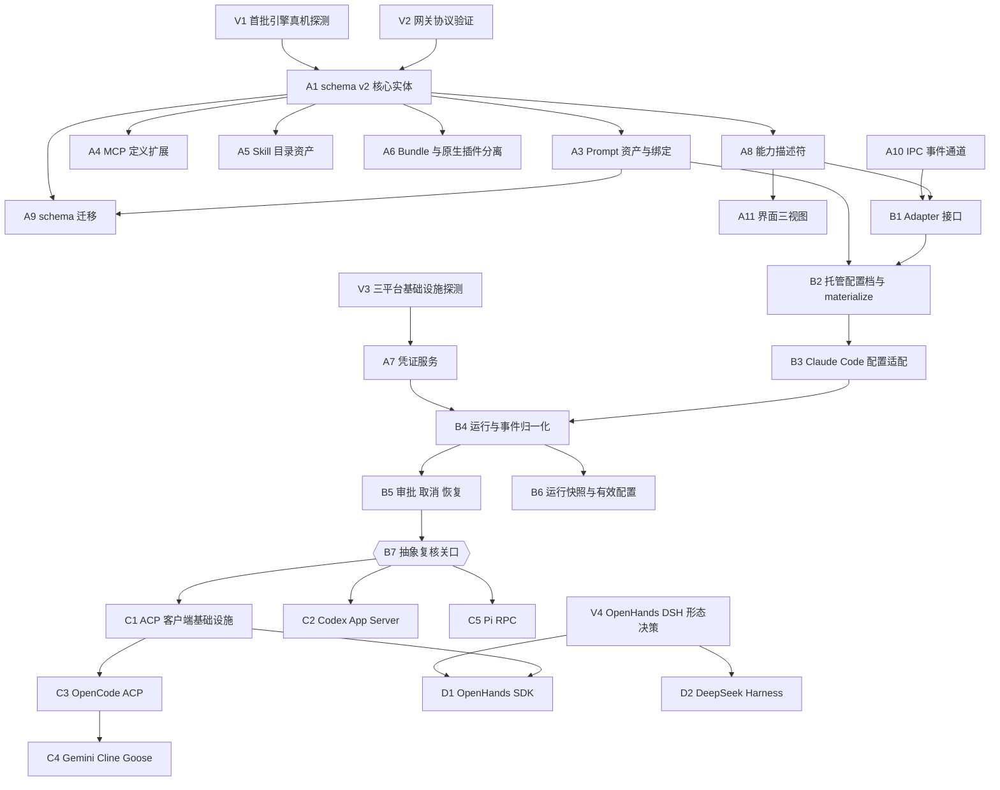

# CLI Agent 接入落地计划

编制日期：**2026-09-17**。

本文把 [CLI Agent 接入调研](cli-agent-research.md) 的设计建议拆成带优先级和依赖关系的工作项。**这是工程计划，不是实现记录；下列工作项当前一项都未开始。** 当前工程的真实边界见 [架构约定](architecture.md) 与 [README](../README.md)。

调研文档已声明：九个引擎**未经安装、启动或调用验证**，其字段映射全部来自官方文档与源码快照。因此本计划把"真机探测"前置为阶段 0，而不是把纸面映射直接当作 adapter 的设计输入。

## 1. 现状与目标的距离

当前工程约 1.8k 行（含测试），是一个纯配置 CRUD：`Workspace` 由 agents / mcpServers / skills / plugins 组成，preload 仅暴露 `loadWorkspace / saveWorkspace / getAppInfo` 三个 invoke 通道（[`src/shared/api.ts:10`](../src/shared/api.ts)），没有子进程、网络、凭证或事件流代码。

调研文档要求的是一个多引擎运行时宿主。差距不是补字段，而是**重写数据层 + 新建运行时**。因此本计划包含一次破坏性 schema 变更（`schemaVersion` 1 → 2）和一条独立的 IPC 事件通道改造。

## 2. 约定

**优先级。**

| 级别 | 含义                                             |
| ---- | ------------------------------------------------ |
| P0   | 关键路径；不完成则后续阶段无法开始               |
| P1   | 本阶段交付必需；可在阶段内与 P0 并行推进         |
| P2   | 可延后到后续阶段，但公开发布前必须补齐或明确降级 |

**编号。** `V` 前置验证、`A`–`D` 对应调研文档 §9.1 的四个阶段、`X` 贯穿项。

**完成定义。** 每个工作项的"交付与验收"列即其完成定义。涉及引擎行为的工作项，只有在**绑定了具体安装版本**的真机验证通过后，才能把能力状态从 `unverified` 升级为已验证；仅通过 fixture 的视为未验证。

## 3. 依赖关系总览

**关键路径：** `V1 → A1 → A8 → B1 → B2 → B3 → B4 → B5 → B7`。其余工作项要么可并行，要么挂在关键路径之后。

**阶段 A 内有三条可并行的线，收敛于 B1 / B4：**

1. **数据模型线**：A1 → A3 / A4 / A5 / A6 → A9
2. **管道线**：A10（IPC 事件通道）——不依赖 schema 重构，可立即开工
3. **凭证线**：V3 → A7 → X3

把 A10 和 A7 排在数据模型之后是常见的排期错误：它们是 B4 的硬前置，而且与 A1 无耦合，应当同期启动。

## 4. 阶段 0：接入前验证（V）

调研文档 §9.3 列出六项未解决事项。本阶段的目的是**在写任何 adapter 之前把纸面映射降级或确认**，成本远低于事后返工。

| ID  | 工作项                                                                                                                       | 优先级 | 依赖 | 交付与验收                                                                              |
| --- | ---------------------------------------------------------------------------------------------------------------------------- | ------ | ---- | --------------------------------------------------------------------------------------- |
| V1  | 安装首批三个引擎（Claude Code、Codex、OpenCode），记录真实版本、配置文件实际路径、系统提示词入口是否存在、程序化接口能否握手 | P0     | —    | `docs/engine-probe-<日期>.md`；逐条标注调研文档的映射为"确认 / 有出入 / 不存在"         |
| V2  | 用一个真实网关验证协议兼容性：流式事件、工具调用、模型 ID                                                                    | P0     | —    | 结论写入 V1 产出；明确 Responses 与 Chat Completions 的边界。"能列出模型"不作为通过依据 |
| V3  | 三平台探测：配置路径、进程树终止、系统凭证库可用性、沙箱能力                                                                 | P1     | —    | 每个平台一份结论；不能用单平台结果推断其余平台                                          |
| V4  | OpenHands 与 DSH 的运行形态调研：Python 运行时依赖、Agent Server 生命周期、DSH SDK 版本契约                                  | P2     | —    | 输出给决策 Q3 的事实依据；阻塞 D 阶段，不阻塞 A / B / C                                 |

V1 与 V2 的结论直接决定 A1 的引擎枚举与协议枚举取值，因此二者是关键路径起点。

## 5. 阶段 A：配置与能力基础

对应调研文档 §5、§8。目标：可以创建配置档、查看兼容性、预览导出；**不把未连接状态显示为运行成功**。

| ID  | 工作项                                                                                                    | 优先级 | 依赖           | 交付与验收                                                                                                                                                                                                         |
| --- | --------------------------------------------------------------------------------------------------------- | ------ | -------------- | ------------------------------------------------------------------------------------------------------------------------------------------------------------------------------------------------------------------ |
| A1  | schema v2 核心实体：拆出 `EngineInstallation` / `ModelConnection` / `ModelProfile` / `AgentProfile`       | P0     | V1, V2         | `src/shared/engines/`；一个连接只对应一种协议；采样与 reasoning 参数全部可缺省，移除当前必填的 `temperature` 与默认 `0.7`（[`workspace.ts:22`](../src/shared/workspace.ts)、[`:124`](../src/shared/workspace.ts)） |
| A3  | `PromptAsset` + `PromptBinding`：内容版本化，绑定表达 append / replace / 项目规则，以及跟随最新或固定版本 | P0     | A1             | 替换现有 `systemPrompt: string`（[`workspace.ts:21`](../src/shared/workspace.ts)）；绑定记录 `nativePromptTarget` 与生效时机                                                                                       |
| A4  | `McpServerDefinition` 扩展：OAuth、headers、cwd、超时；legacy SSE 单独标记                                | P1     | A1             | 保持可区分联合；不把 SSE 静默当作 Streamable HTTP                                                                                                                                                                  |
| A5  | `SkillAsset` 目录资产：`SKILL.md`、frontmatter、脚本与 references、digest                                 | P1     | A1             | 首次引入用户目录读取，需同时确定主进程文件访问边界；保留纯 Markdown 作为轻量类型                                                                                                                                   |
| A6  | `Plugin` 更名为 `CapabilityBundle`，另立 `NativePluginInstallation`                                       | P2     | A1             | 消除与各 CLI 可执行插件的同名歧义；现有资源组合行为不变                                                                                                                                                            |
| A7  | `Credential` 服务与系统凭证库                                                                             | P0     | V3             | `src/main/credentials/`；workspace 只存引用，渲染层只拿到已配置状态与脱敏元信息                                                                                                                                    |
| A8  | 能力描述符：按"引擎 + 版本 + 模式 + profile"计算，五态而非布尔                                            | P0     | A1, V1         | 状态取值 `native / adapter / extension-required / unsupported / unverified`，附 `constraints` 与证据来源；驱动绑定校验（如 Chat Completions-only 网关绑定 Responses 路线时提前阻止）                               |
| A9  | `schemaVersion` 1 → 2 迁移与备份                                                                          | P0     | A1, A3, A4, A5 | 旧 `systemPrompt` 迁为资产但标记"待选择引擎 / 绑定方式"，不擅自归属某个 CLI；旧 `provider / baseUrl / model` 转为待确认协议的连接；保留旧 workspace 备份                                                           |
| A10 | IPC 从三个 invoke 通道扩展出事件订阅机制                                                                  | P0     | —              | `src/shared/api.ts`、`src/preload/index.ts`、`src/main/index.ts`；保持 `contextIsolation` 与 sender 校验，不暴露 `ipcRenderer` 或任意 fs / shell                                                                   |
| A11 | 界面三视图重排：共享资源库 / Agent 列表 / 通用+专属+有效配置预览+诊断                                     | P1     | A1, A8         | 专属字段由带版本 schema 驱动，高级 JSON 文本框不作为唯一入口                                                                                                                                                       |

A1 与 A2 合并为一项：采样参数可缺省是 A1 的验收条件之一，不单列工作项，但它是调研文档 §3.2 明确点名的问题，迁移与编辑器都要覆盖。

## 6. 阶段 B：首个引擎闭环（Claude Code）

对应调研文档 §6。目标：用一个真实引擎**证伪**阶段 A 的抽象，而不是同时铺开九个。

| ID  | 工作项                                                                                                                  | 优先级 | 依赖        | 交付与验收                                                                                                                                              |
| --- | ----------------------------------------------------------------------------------------------------------------------- | ------ | ----------- | ------------------------------------------------------------------------------------------------------------------------------------------------------- |
| B1  | `EngineAdapter` 接口：probe / inspect / validate / plan / materialize / launch / observe / cancel-resume-dispose 八阶段 | P0     | A1, A8, A10 | `src/main/engines/adapters/`；接口按 Claude Code 的真实行为定义，暂不为未验证引擎预留抽象                                                               |
| B2  | 托管配置档与 materialize                                                                                                | P0     | B1, A3      | `src/main/engines/config/`；落盘到 `userData/engines/<installationId>/profiles/<profileId>/`；不改写系统 `HOME` 制造隔离假象；`plan` 需说明实际配置来源 |
| B3  | Claude Code 配置适配：probe / inspect / validate / plan / materialize                                                   | P0     | B2, V1      | 追加与替换提示词分别映射；`CLAUDE.md` 作为项目规则不被覆盖；认证区分 `X-Api-Key` 与 Bearer                                                              |
| B4  | 子进程运行与事件归一化                                                                                                  | P0     | B3, A7, A10 | `src/main/sessions/`；保留 `rawEvent` 引用；缺失的 cost / tokens / tool status 显示为未知，不补零；凭证经环境注入，不拼进命令行参数                     |
| B5  | 审批、取消、恢复                                                                                                        | P1     | B4          | 审批响应只完成对应原生请求；显式应用用户所选策略，不依赖 CLI 默认值                                                                                     |
| B6  | `RunSnapshot` 与有效配置视图                                                                                            | P1     | B4          | 记录本次运行的资源版本、引擎版本、原生 session ID 与配置摘要，不含明文凭证                                                                              |
| B7  | **抽象复核关口**                                                                                                        | P0     | B5, B6      | 用 B3–B6 的真实行为回头修正 A1 / A8 / B1；产出接口变更清单并落地后，才允许开始 C 阶段                                                                   |

B7 是决策关口而非编码任务，但必须占据一格。跳过它意味着后八个 adapter 会按未验证的纸面文档设计接口，返工成本随引擎数量线性放大。

## 7. 阶段 C：接口复用扩展

| ID  | 工作项                       | 优先级 | 依赖   | 交付与验收                                                                      |
| --- | ---------------------------- | ------ | ------ | ------------------------------------------------------------------------------- |
| C1  | ACP 客户端基础设施           | P1     | B7     | 归一化事件复用 B4 的模型；每个引擎仍保留独立的配置与能力适配                    |
| C2  | Codex App Server adapter     | P1     | B7     | 使用该安装版本生成的 schema / 类型，不假设通用 JSON-RPC 结构                    |
| C3  | OpenCode ACP adapter         | P1     | C1     | MCP 由适配器转换，不直接复制现有 `command` / `args` 结构；验证配置层级优先级    |
| C4  | Gemini、Cline、Goose adapter | P1     | C1, C3 | 复用 ACP 客户端并逐个记录差异；Cline 的 `--auto-approve` 默认值差异必须显式处理 |
| C5  | Pi RPC adapter               | P2     | B7     | RPC 按 LF 严格分隔；MCP 标注为 `extension-required`，无扩展时不显示为已连接     |

C3 先于 C4：OpenCode 用来验证 ACP 抽象是否真的可复用，验证通过再一次接三个。

## 8. 阶段 D：专门适配

| ID  | 工作项                       | 优先级 | 依赖   | 交付与验收                                                                 |
| --- | ---------------------------- | ------ | ------ | -------------------------------------------------------------------------- |
| D1  | OpenHands SDK / Agent Server | P2     | V4, C1 | 区分 `openhands-sdk` 与 `openhands-cli-legacy`；处理 Python 与服务生命周期 |
| D2  | DeepSeek Harness             | P2     | V4     | 固定版本，界面标记实验状态；ACP 已知缺失的交互能力不由通用客户端假造       |

## 9. 贯穿项

| ID  | 工作项                               | 优先级 | 依赖   | 交付与验收                                                            |
| --- | ------------------------------------ | ------ | ------ | --------------------------------------------------------------------- |
| X1  | fake CLI fixture 与 adapter 契约测试 | P0     | B1     | 每个 adapter 的准入条件；覆盖映射与生命周期，再对明确版本做真机冒烟   |
| X2  | 调研文档 §9.2 九条验收清单模板化     | P1     | B1     | 每个 adapter 逐条留痕；需要模型调用的验证单独记录服务、模型与执行日期 |
| X3  | 凭证脱敏审计                         | P0     | A7     | 普通日志、命令预览、配置导出均不含 key；多个运行之间环境与资源不串用  |
| X4  | 三平台真机冒烟                       | P1     | V3, B4 | 路径、进程树终止、凭证库、沙箱分平台验证，不跨平台推断                |

## 10. 待决策事项

以下四项需要在对应阶段开工前确认；每一项都会改变工作量估计。

| 编号 | 决策                                             | 阻塞   | 建议                                                                               |
| ---- | ------------------------------------------------ | ------ | ---------------------------------------------------------------------------------- |
| Q1   | 首批是九个全做，还是先三个？                     | A1, B7 | 按调研文档 §9.1：九个都在配置层支持，运行能力只先做 Claude Code / Codex / OpenCode |
| Q2   | 是否执行阶段 0 的真机探测？                      | 全部   | 执行。当前所有映射都是纸面结论，直接写 adapter 的返工风险集中在最贵的 B / C 阶段   |
| Q3   | OpenHands 是否引入 Python 运行时依赖？           | D1     | 先只保留旧 CLI 的 ACP 兼容入口，把打包与分发影响留到 D 阶段单独评估                |
| Q4   | 凭证库选型：Electron `safeStorage` 还是 keytar？ | A7     | 先用内置 `safeStorage`，由 V3 的三平台探测结论确认可用性后再定是否引入原生依赖     |

## 11. 不在本计划范围内

- AgentMatrix 自研 Agent 的 provider loop 与自建 agent 循环。调研文档 §8 的结论是先建 CLI adapter，避免把第三方 CLI 再套一层重复循环。
- 任务调度与多 Agent 协作（README「下一阶段」第 4 条的后半部分）。
- 品牌图标、签名、公证与分发验证。
- 任何第三方 Pi MCP 扩展的选型。调研文档未把任何第三方扩展当作已验证依赖，本计划同样不预设。
