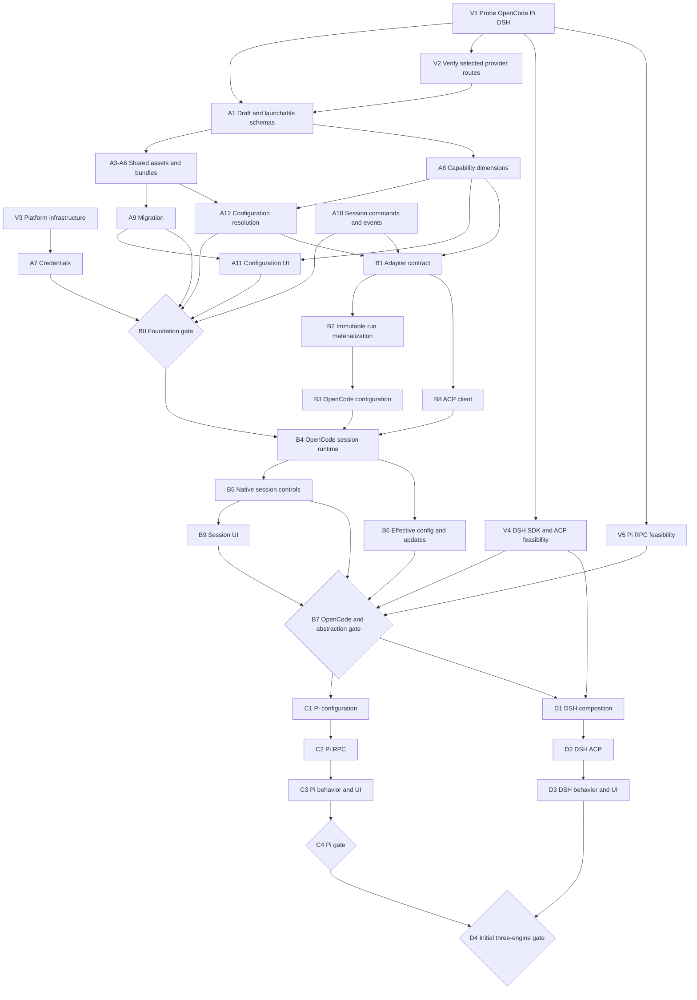

# CLI agent integration implementation plan

Prepared: **2026-09-17**. English edition and scope revision: **2026-09-18**.

**The first delivery targets are OpenCode, Pi, and DeepSeek Harness, in that order.** OpenCode establishes the ACP integration and complete desktop workflow; Pi tests the same application contracts through RPC; DeepSeek Harness adds a version-pinned ACP integration selected after probing its SDK. Claude Code, Codex, Gemini CLI, Cline, Goose, and OpenHands remain later integrations.

This document turns the [CLI agent research](cli-agent-research.md) into implementation tasks. **Implementation has started; see the [status record](implementation-status.md) for completed work and remaining gates.** Existing English/Chinese UI support does not implement the proposed runtime. See [Architecture](architecture.md) and the [README](../README.md) for current behavior.

The research is documentary evidence: the nine engines were not installed, launched, or called for compatibility testing. The product ordering remains a scope decision. The [2026-09-18 probes](engine-probe-2026-09-18.md) add initial installed-release evidence; handshake success alone is not runtime acceptance.

## 1. Delivery scope

At the planning baseline, the application provided configuration CRUD and three invoke methods: `loadWorkspace`, `saveWorkspace`, and `getAppInfo` ([API contract](../src/shared/api.ts)). At that baseline there was no agent subprocess, credential vault, session command API, or event stream. See the status record for implemented additions. Integration requires schema v2, a configuration resolver, and a session runtime with a desktop UI.

| Engine                 | Initial runtime route                                               | Required integration focus                                                                                                           | Explicit boundary                                                                                                                            |
| ---------------------- | ------------------------------------------------------------------- | ------------------------------------------------------------------------------------------------------------------------------------ | -------------------------------------------------------------------------------------------------------------------------------------------- |
| OpenCode               | ACP through the installed `opencode acp`                            | Provider SDK/protocol mapping, prompt and Skill discovery, MCP conversion, native configuration precedence, interactive permissions  | Do not treat an explicit configuration file as complete isolation from project or managed settings                                           |
| Pi                     | `pi --mode rpc`                                                     | LF-delimited RPC, model definitions, prompt semantics, Skill directories, project trust, session operations                          | MCP requires a separately validated extension; ordinary tool-approval popups are not a native guarantee                                      |
| DeepSeek Harness (DSH) | `dsh --profile acp`, selected by the V4 probe; SDK support deferred | Profile/plugin composition, provider routes, persona versus complete prompt replacement, native interaction and session capabilities | Pin the engine and protocol contract; keep experimental labeling. ACP exposes a limited interaction surface and is not SDK/UI feature parity |

Research sections 3.3, 3.4, and 3.9 contain the source mappings. Reusing Pi-related provider code inside DSH does not make their runtime protocols or configuration formats interchangeable.

The first delivery includes shared prompts, model connections and credential references, MCP definitions, Skill assets, resource bundles, engine-specific forms, and session controls. Unsupported bindings remain editable drafts with diagnostics but cannot be launched as if supported. A Pi profile without an MCP extension can still run without MCP bindings if its execution policy is compatible.

**Configuration ownership:** import existing native configuration read-only, retain provenance and unknown fields, and generate AgentMatrix-owned run files. Native configuration write-back and bidirectional synchronization are deferred. Existing user/project rules are preserved; unavoidable external sources are reported rather than described as isolated.

**Native import progress:** the first [OpenCode importer](native-configuration-import.md) now previews a selected JSON/JSONC file, appends shared resources and disabled Agent drafts, encrypts credentials and exact source bytes, and retains immutable field mappings and unconverted-field diagnostics. Bilingual Electron import/restart and an imported profile's native model call pass a local fixture. [Pi file-group import](pi-native-configuration-import.md) now also preserves model/auth/settings and both Prompt sources, with stored-auth precedence and a verified imported native turn. [DSH selected YAML import](dsh-native-configuration-import.md) now covers both provider routes, cross-folder previews, partial patch/settings composition and encrypted credential copies with precedence diagnostics. Combined native precedence, referenced-resource ingestion, and complete runtime override provenance remain open; this increment does not pass B3/A12 or a delivery gate.

**Native plugin scope:** distinguish resource bundles from executable plugins. Initially recognize and bind explicitly selected installed plugins, with version/source checks. Building the pinned DSH runtime composition is part of its adapter. A general plugin marketplace, arbitrary package installation, and automatic upgrades are deferred. No Pi MCP extension is selected implicitly.

### 1.1 Shared configuration and per-engine settings

The shared library owns reusable content and connection definitions. An agent profile owns its engine selection, resource bindings, and native options. Sharing a resource does not mean that every engine applies it with identical semantics. The following table defines adapter work for the initial milestone; it does not claim that these mappings are implemented or runtime-verified.

| Configuration          | Maintained once in the shared library                                                         | OpenCode adapter / options                                            | Pi adapter / options                                                                                                          | DeepSeek Harness adapter / options                                                                        |
| ---------------------- | --------------------------------------------------------------------------------------------- | --------------------------------------------------------------------- | ----------------------------------------------------------------------------------------------------------------------------- | --------------------------------------------------------------------------------------------------------- |
| Model connection       | Explicit protocol, endpoint, authentication strategy, credential reference, and model profile | Provider SDK selection, provider/model routing, and native precedence | Provider/API-family mapping and model definitions                                                                             | Selected provider component and profile composition; keep the native DeepSeek route distinct              |
| System instructions    | Versioned prompt content with latest/pinned bindings                                          | Native agent prompt and project-instruction mappings                  | Core prompt replacement, appended instructions, and separately discovered context                                             | Persona prefix/suffix versus a complete prompt section in the pinned composition                          |
| Skills                 | Versioned Markdown or captured `SKILL.md` directory with references and scripts               | Native discovery, naming, and enablement                              | Native discovery and project-trust requirements                                                                               | Availability and discovery in the selected profile components                                             |
| MCP                    | Server definitions, transport, authentication references, and bindings                        | Translate only supported native transports and authentication flows   | Unavailable in the core baseline; reject bound MCP resources until a compatible extension is explicitly selected and verified | Verify the selected profile mounts the required components and accepts each transport/authentication flow |
| Resource bundles       | Reusable references to prompts, Skills, and MCP servers                                       | Expand references, then validate each binding                         | Expand references; report extension-dependent bindings individually                                                           | Expand references, then validate against the pinned composition                                           |
| Executable plugins     | A catalog of installed-plugin identity, source, version, and ownership                        | Engine-specific plugin references                                     | Explicit extension selection and compatibility                                                                                | Version-pinned component/profile composition                                                              |
| Execution and sessions | Requested cwd/policy, immutable run inputs, and a common session command/event contract       | ACP adapter with OpenCode-specific controls and capability evidence   | Separate RPC adapter; project trust does not imply general tool approvals                                                     | ACP transport reuse with separate DSH lifecycle, interaction, and persistence mappings                    |

Credential values belong to the main-process vault or an explicitly referenced environment variable. A connection is reusable across profiles only when each adapter validates its protocol, authentication, model, and tool/streaming behavior. A matching endpoint URL alone does not establish compatibility.

The initial editor has shared resource pages and an agent detail view with **General**, **Bindings**, **Engine settings**, and **Resolved preview / diagnostics**. Switching the engine preserves shared assets and bindings, then revalidates them; incompatible bindings remain visible as draft diagnostics. Native options stay associated with their engine and are never silently translated to another engine. Launch remains disabled until the selected configuration passes validation. All controls and diagnostics use the existing English/Chinese catalogs.

## 2. Conventions and acceptance gates

| Priority | Meaning                                                                       |
| -------- | ----------------------------------------------------------------------------- |
| P0       | Required before a dependent integration or release gate can pass              |
| P1       | Required for its delivery milestone; implementation may run alongside P0 work |
| P2       | Deferred expansion or an explicitly optional capability                       |

IDs refer to this revised sequence: `V` for probes, `A` for shared foundations, `B` for OpenCode, `C` for Pi, `D` for DSH, `E` for later engines, and `X` for checks spanning phases. A2 remains folded into A1.

**Definition of done:** task acceptance, contract fixtures, and a real-installation smoke check must pass for the engine/version/mode being claimed. Model-call evidence records the service, protocol, model, and date. Unsupported or untested capabilities remain visible; missing usage/cost is unknown, not zero. New forms, diagnostics, and session controls must support English and Simplified Chinese.

**Delivery gates:** B0 accepts the data/UI foundation; B7 accepts OpenCode and the shared abstractions; C4 accepts Pi; D4 accepts DSH and completes the initial three-engine milestone. Failed checks block the relevant gate. A gate cannot inherit another engine's verification result.

### 2.1 Incremental delivery

| Milestone              | User-visible outcome                                                                                                                                   | Acceptance boundary                                                                                                                                              |
| ---------------------- | ------------------------------------------------------------------------------------------------------------------------------------------------------ | ---------------------------------------------------------------------------------------------------------------------------------------------------------------- |
| Shared foundation — B0 | Maintain connections, credentials, prompts, Skills, MCP, and bundles independently; configure drafts for the three selected engines                    | Migration, compatible editors, resolution diagnostics, and session contracts pass. This milestone alone does not enable agent execution                          |
| OpenCode — B7          | Configure and run OpenCode from the desktop with streaming, tools, supported permission controls, cancellation, and truthful history/recovery behavior | Pass the OpenCode gate with actual endpoint/key calls, shared prompt/Skill/MCP mappings, immutable inputs, bilingual UI, and early Pi/DSH contract evidence      |
| Pi — C4                | Run Pi through the same library and session UI using its RPC adapter                                                                                   | Pass Pi's own endpoint, prompt, Skill, cancellation, and persistence checks. The core baseline has no MCP extension and does not promise universal tool approval |
| DeepSeek Harness — D4  | Run the pinned DSH composition and use shared assets across all three products                                                                         | Pass DSH's own route/lifecycle checks and the cross-engine update scenario. Preserve experimental labeling and the documented ACP feature limits                 |

Each runtime milestone must deliver a complete configuration-to-session workflow. Complete the shared foundation only to the extent required by these three engines; support for the other six products, a general native-plugin installer, and cross-engine conversation migration are outside these gates. Skill capture and MCP mapping belong to the relevant engine's acceptance work rather than a cleanup phase after all three adapters.

## 3. Dependency overview

The diagram summarizes the main dependencies; the task tables also specify test and validation prerequisites. Credentials and IPC contracts can begin alongside schema work. V4 and V5 run early so B7 does not freeze an abstraction tested only with OpenCode. DSH adapter work may proceed alongside Pi after B7, while delivery acceptance remains OpenCode → Pi → DSH.

## 4. Phase 0: verify the three selected engines

| ID  | Work item                                                      | Priority | Depends on | Deliverable and acceptance                                                                                                                                                                                                                                                                                                                                                      |
| --- | -------------------------------------------------------------- | -------- | ---------- | ------------------------------------------------------------------------------------------------------------------------------------------------------------------------------------------------------------------------------------------------------------------------------------------------------------------------------------------------------------------------------- |
| V1  | Probe installed OpenCode, Pi, and DSH releases                 | P0       | —          | `docs/engine-probe-<date>.md`: absolute executable paths, versions, required runtimes, configuration/discovery paths, prompt entry points, and protocol handshakes. Record each mapping as confirmed, different, or unavailable                                                                                                                                                 |
| V2  | Verify selected custom endpoint, protocol, and key routes      | P0       | V1         | For each initial engine, verify at least one intended route with a streamed response and tool round trip. Distinguish Chat Completions, Responses, and Anthropic Messages where selected; preserve DSH's separate native DeepSeek route. Model listing alone is insufficient                                                                                                    |
| V3  | Probe platform infrastructure                                  | P0       | —          | Test the development host first: executable discovery, GUI process environment, paths, process-tree termination, credential backend, and sandbox boundaries. Record separate results before enabling Windows/macOS/Linux support; no inference from another platform                                                                                                            |
| V4  | Verify DSH SDK feasibility and select its integration contract | P0       | V1         | Test the shipped SDK launcher, framing/handshake, turn submission, events, interaction responses, cancellation, and persistence. Record whether resume includes history replay. Pin matching versions and identify missing operations. Any ACP alternative has an explicit reduced feature contract; unresolved DSH feasibility blocks its adapter, not OpenCode/Pi development |
| V5  | Exercise a minimal Pi RPC interaction                          | P0       | V1         | Submit a prompt, correlate responses and streaming events, cancel a turn, and probe session restoration. Check LF framing and project trust in noninteractive mode. Distinguish extension UI requests from enforceable approval for all tools; document MCP absence without an extension                                                                                        |

V4 and V5 are small executable probes, not full adapters. B7 requires their evidence and a documented decision for each limitation, not unsupported features to be invented. Full DSH integration remains a required initial deliverable; an unavailable route is reported as a blocker, not silently removed from scope.

A probe task produces a recorded result, including failures or unavailable routes. That evidence can inform shared schemas without blocking unrelated engines. It does not satisfy runtime acceptance: each engine's delivery gate still requires passing checks for its required features and at least one actual custom endpoint/key route.

## 5. Phase A: shared configuration and session contracts

| ID  | Work item                                                             | Priority | Depends on         | Deliverable and acceptance                                                                                                                                                                                                                                                                                                                                                                           |
| --- | --------------------------------------------------------------------- | -------- | ------------------ | ---------------------------------------------------------------------------------------------------------------------------------------------------------------------------------------------------------------------------------------------------------------------------------------------------------------------------------------------------------------------------------------------------- |
| A1  | Schema v2: installations, connections, model profiles, agent profiles | P0       | V1, V2             | `src/shared/engines/`; distinguish persistable drafts from validated launchable inputs. Drafts may lack an engine, protocol, credentials, or prompt binding mode and retain migration provenance. Launch validation requires resolved references and one confirmed protocol per connection. Sampling/reasoning parameters are optional; remove unconditional `0.7`                                   |
| A3  | Versioned prompts and bindings                                        | P0       | A1                 | Assets support latest/pinned references; bindings record append/replace/project-rule intent, native target, and application timing. Define deterministic ordering and reject incompatible multiple replacement prompts instead of concatenating silently                                                                                                                                             |
| A4  | MCP definitions and authentication references                         | P1       | A1                 | Discriminated stdio / Streamable HTTP / legacy SSE structures, cwd, timeouts, ordinary/secret headers, and auth strategies. Map only supported native flows; identify whether the engine or AgentMatrix owns authentication. Schema support alone is not a working OAuth connection                                                                                                                  |
| A5  | Skill directory assets                                                | P1       | A1                 | Import `SKILL.md`, frontmatter, scripts, and references with versions/digests; preserve plain Markdown as a lightweight type. Define file-access and symlink boundaries, duplicate-name handling, and complete asset capture before launch                                                                                                                                                           |
| A6  | Resource bundles and native plugin references                         | P0       | A1                 | Rename `Plugin` to `CapabilityBundle`, preserving IDs and bindings. Keep `NativePluginInstallation` separate with engine, source, version, and availability. No executable installation implied by a resource binding                                                                                                                                                                                |
| A7  | Main-process credential service                                       | P0       | V3                 | OS-backed storage and typed set/replace/delete/status operations. Ordinary configuration stores references; reads return redacted metadata. Define unavailable-backend behavior without silently storing unprotected secrets; verify replacement and restart behavior                                                                                                                                |
| A8  | Capability descriptors with independent dimensions                    | P0       | A1, V1             | Separate mechanism (`native / adapter / extension-required / unsupported / unknown`), verification (`untested / passed / failed`), and current availability with reasons. Attach documentary/runtime evidence, engine version, mode, profile, and relevant model route; changed installations invalidate stale verification                                                                          |
| A9  | Schema 1 → 2 migration                                                | P0       | A1, A3, A4, A5, A6 | Version-dispatched loading, preserved original backup, atomic publication, and recovery after interruption. Preserve prompt content, resource IDs, and converted bundle references. Do not choose an engine/protocol/binding mode implicitly; retain unresolved records as drafts. Test repeated loading, referential integrity, old temperature preservation as a draft value, and failed migration |
| A10 | Bidirectional session API and state model                             | P0       | —                  | Define session creation/start, message submission, native interaction response, cancellation, resume, close, state queries, and event subscription with cursor/unsubscribe. Distinguish session, run/process attachment, turn, and request IDs. Validate IPC payloads and senders; keep stable localizable errors and expose no arbitrary shell/filesystem access                                    |
| A11 | Shared library and engine-specific configuration UI                   | P1       | A7, A8, A9, A12    | Initial forms cover the three selected engines, draft diagnostics, shared bindings, secret status, and resolved previews. Other engines may appear as planned catalog entries without active adapters. Include both languages; raw JSON is supplementary                                                                                                                                             |
| A12 | Resolution, provenance, and configuration application contract        | P0       | A3, A4, A5, A6, A8 | Define deterministic binding/override rules and name conflicts. Distinguish desired, resolved/planned, and observed values with per-field source/evidence. Define saved / pending-new-session / applied / failed-or-unknown states, impact reporting, and resume compatibility checks                                                                                                                |

**Session identity:** a conversation may outlive a process; a turn is one submitted interaction, not a process lifetime. Start with at most one active turn per session and diagnose concurrent submissions. Native IDs remain namespaced by installation/session. Pending requests settle once; late responses after cancellation or disconnect cannot authorize a different request. Renderer reloads reattach to state and events without resubmitting work. App crashes mark unfinished runs interrupted and offer only verified native recovery.

**Configuration application:** a save updates shared assets, not a running process. New sessions resolve new revisions. Resume validates the previous snapshot, native persistence, executable version, credentials, and external-source changes. If continuity cannot be established, diagnose it or offer a distinct new session; never describe a new session as native resume. Supported live changes require an explicit operation, acknowledgment, and a new effective revision.

**Capability progress:** Shared [engine compatibility checks](engine-capabilities.md) now feed Agent previews, disabled launch controls, the desktop factory, and all three planners. Configuration-scoped descriptors distinguish contract evidence from runtime evidence and preserve independent mechanism/verification/availability. [Native capability reports](session-capabilities.md) now aggregate captured attachment checks, bounded protocol/restoration observations, and credential resolution into eighteen explicit scopes. Native declarations remain separate from verified use; historical processes and changed contracts cannot supply current availability. Broader native verification coverage and full A8 acceptance remain open.

## 6. Phase B: complete OpenCode through ACP

| ID  | Work item                                       | Priority | Depends on                         | Deliverable and acceptance                                                                                                                                                                                                                                                                                                                                    |
| --- | ----------------------------------------------- | -------- | ---------------------------------- | ------------------------------------------------------------------------------------------------------------------------------------------------------------------------------------------------------------------------------------------------------------------------------------------------------------------------------------------------------------- |
| B0  | Foundation gate                                 | P0       | A7, A9, A10, A11, A12              | Existing workspaces migrate; unresolved drafts remain editable but cannot launch. The initial three-engine configuration model, credential API, resolution contract, and session API agree                                                                                                                                                                    |
| B1  | Configuration and runtime adapter contracts     | P0       | A1, A8, A10, A12                   | `src/main/engines/adapters/`; configuration operations cover probe/inspect/validate/plan/materialize; runtime covers connect/start, send, respond to interactions, observe, cancel, resume, close, and dispose. Optional operations have explicit capability failures. Validate the shape against V4/V5 before B7                                             |
| B2  | Immutable inputs and run materialization        | P0       | B1, A3, A5, A12                    | Resolve and capture asset revisions before spawn. Write config/prompts/Skills under `userData/runs/<runId>/` using a staged manifest and atomic publication. Mutable profile directories store definitions, never shared live input files. Separate writable native state from frozen inputs; define reuse, retention, and cleanup for resume                 |
| B3  | OpenCode configuration adapter                  | P0       | B2, V1                             | Map providers and their SDK/protocol, model routing, prompts, Skills, and MCP definitions to the installed schema. Convert stdio command/args and environment fields. Inspect native sources and precedence, preserve user rules/unknown fields, and diagnose collisions or policy overrides                                                                  |
| B8  | ACP client infrastructure                       | P0       | B1, V1                             | Negotiate protocol and capabilities; handle requests, responses, notifications, and timeouts. Implement permission replies. Declare file/terminal client capabilities only when their main-process services and lifecycle cleanup exist; otherwise omit them and verify the engine's behavior. Preserve native stop reasons and optional session capabilities |
| B4  | OpenCode session runtime and events             | P0       | B0, B3, B8                         | `src/main/sessions/`; start only from a validated run snapshot, supervise process trees, and inject minimal credentials via supported env/SDK/native channels rather than arguments. Normalize bounded event streams, preserve redacted native evidence, persist session metadata, and support renderer reconnection                                          |
| B5  | Native interaction and lifecycle controls       | P0       | B4                                 | Resolve only matching approval/interaction requests; honor the chosen supported policy. Verify cancellation during streaming/tools/approval, timeouts, crashes, and supported native resume. Failed or late replies cannot leave a session waiting forever or resume work accidentally                                                                        |
| B6  | Effective configuration and update reporting    | P0       | B4, A12                            | Extend the prelaunch snapshot with observed source/value evidence, native session ID, and application outcomes. Unsupported readback stays unknown. Editing an asset shows affected profiles and pending sessions; successful file generation is not proof that the engine loaded it                                                                          |
| B9  | Complete desktop session UI                     | P1       | B4, B5                             | Start from an agent profile; select cwd; send multiple turns; show streamed messages, tools, permissions, failures, cancellation, and history/resume controls. Reload/reconnect without duplicate messages or stale approval controls. Verify English and Chinese                                                                                             |
| B7  | OpenCode acceptance and abstraction review gate | P0       | B5, B6, B9, V4, V5, X1, X2, X3, X4 | Pass a real OpenCode UI flow and the tests in section 10. Review A1/A8/A10/B1 against actual Pi RPC and DSH SDK/ACP probe results. Implement required contract changes before complete second/third adapters; record DSH-specific blockers without conflating them with OpenCode readiness                                                                    |

**Snapshot boundary:** record resolved asset versions, executable/version, adapter contract version, requested policy, cwd, sanitized launch metadata, and digests before execution. Add observations later without rewriting the original plan. Never persist plaintext credentials; record secret references/rotation metadata only. Native transcripts and session state may be mutable and need separate lifecycle storage. External project/global/managed files are not frozen merely because generated files are: capture provenance, recheck changes, and label limits to reproducibility.

**Reporting progress:** Per-session [configuration reports](configuration-report.md) now expose captured inputs, bounded native evidence, historical attachment checks, and saved-versus-captured asset revisions. Library editors now offer bilingual [impact previews](library-impact.md) for related profiles and retained conversations, honoring fixed/direct bindings and showing unresolved or unreadable cases. [Credential revision reporting](credential-rotation.md) now records the version resolved for a successful attachment and compares it with current metadata without reading secret values. New starts and native resumes re-resolve captured references; running processes retain their prior inputs. B6 remains open for complete native override provenance; these reports do not pass B7/C4/D4 or the full X3 audit on their own.

**Required configuration checks:** changing a shared asset must not overwrite a previous run's captured inputs; two sessions from one profile must not share mutable generated configuration; native overrides must be visible; a resumed conversation must not silently claim a newly edited prompt was applied. Retain asset revisions needed by resumable sessions even if the library item is later deleted.

## 7. Phase C: Pi as the second engine

| ID  | Work item                                   | Priority | Depends on             | Deliverable and acceptance                                                                                                                                                                                                                                                                           |
| --- | ------------------------------------------- | -------- | ---------------------- | ---------------------------------------------------------------------------------------------------------------------------------------------------------------------------------------------------------------------------------------------------------------------------------------------------- |
| C1  | Pi configuration adapter                    | P0       | B7, V5                 | Map model providers/API families, key references, prompt replacement/append, context files, and Skill discovery. Use the installed configuration-home contract; represent project trust explicitly without overwriting unrelated user trust decisions                                                |
| C2  | Pi RPC transport and sessions               | P0       | C1, B4, V5             | Split frames strictly on LF, correlate RPC responses and events, submit additional turns, cancel, and map verified native session operations. Keep Pi-specific events available instead of inventing ACP equivalents                                                                                 |
| C3  | Pi policy, extensions, and desktop behavior | P1       | C2, B9                 | Use shared session UI with engine-specific diagnostics. Show MCP as unavailable until a selected compatible extension is verified. Do not equate project trust or extension UI with universal per-tool approvals or an OS sandbox. Block profiles requiring controls the installation cannot enforce |
| C4  | Pi acceptance gate                          | P0       | C3, B6, X1, X2, X3, X4 | Complete real UI, custom endpoint/key, shared prompt/Skill, cancellation, persistence, and update tests on a pinned installed version. Record unsupported capabilities explicitly; a no-MCP configuration is a valid baseline, while MCP bindings require separate extension acceptance              |

Pi MCP extension discovery and installation are optional follow-up work. They do not block a valid core Pi integration and cannot be used to claim that Pi supports MCP or approval enforcement before verification.

## 8. Phase D: DeepSeek Harness as the third engine

| ID  | Work item                                       | Priority | Depends on                 | Deliverable and acceptance                                                                                                                                                                                                                                                                                                                                        |
| --- | ----------------------------------------------- | -------- | -------------------------- | ----------------------------------------------------------------------------------------------------------------------------------------------------------------------------------------------------------------------------------------------------------------------------------------------------------------------------------------------------------------- |
| D1  | Versioned DSH profile and configuration adapter | P0       | B7, V4, B2                 | Pin the engine, selected protocol contract, and required plugin/bundle composition. Materialize a supported managed profile with verified patch precedence and reload behavior. Map persona prefix/suffix separately from complete prompt replacement; reject conflicting complete sections. Keep general provider routes separate from the native DeepSeek route |
| D2  | DSH ACP runtime                                 | P0       | D1, V4, B4                 | Implement the selected ACP transport and lifecycle, messages, tools, interaction replies, cancellation, native persistence, and advertised history behavior. Inspect effective MCP/Skill components; the product name alone does not establish that a profile mounts them                                                                                         |
| D3  | DSH-specific configuration and interaction UI   | P1       | D2, B9                     | Expose supported profile, patch, provider, prompt, and execution options. Render supported native interaction payloads without silently auto-answering them. Show experimental version support; unsupported features are diagnosed. Do not infer event replay from resume support                                                                                 |
| D4  | DSH and initial three-engine acceptance gate    | P0       | D3, C4, B6, X1, X2, X3, X4 | Pass DSH checks and the cross-engine scenario below. Record the exact supported engine/protocol versions, routes, platform coverage, and limitations. Required unimplemented DSH behavior remains a blocker rather than a completed milestone                                                                                                                     |

V4 selected ACP for DSH 0.1.5-rc.2 because the published SDK lacks native cancel/resume methods. See the [decision and evidence](engine-probe-2026-09-18.md) and subsequent [local ACP lifecycle results](dsh-acp.md). The installed profile forwards committed messages rather than provider token deltas, and its usage updates describe context occupancy. The ACP integration excludes DSH-specific cards, terminal interaction, elicitation, forks, and native transcript replay; it cannot be described as SDK or native UI parity. Initial core acceptance still requires an actual DSH runtime, custom connection and prompt configuration, visible events, cancellation, and truthful persistence behavior.

**Implementation evidence:** D1 configuration and the D2/D3 runtime/desktop path now pass local macOS fixtures; see [DSH runtime evidence](dsh-runtime.md). Both provider components are verified through the production factory/coordinator. ACP has no effective permission-policy readback: captured composition checks and native behavioral fixtures provide the current policy evidence. D4 remains open for its full acceptance requirements. A separate [installed DSH plugin contract](dsh-plugin-contract.md) verifies native lifecycle behavior and startup-readiness mechanisms. [Production selected-module activation](dsh-plugin-activation.md) now passes both provider routes and a bilingual Electron fixture, including options, boot/session checks, and resume. General bundle patch import and complete plugin dependency provenance remain open.

**Cross-engine scenario:** bind one shared prompt and one Skill asset to OpenCode, Pi, and DSH using verified native mappings. Use a common model connection only where all selected routes are proven compatible; otherwise use distinct connections without protocol translation. Run a task in each engine, edit the shared assets, and show correct versions in old and new sessions. Verify MCP separately for OpenCode and the selected DSH composition; Pi without an extension must clearly reject MCP bindings.

**Scenario evidence:** The [combined desktop fixture](shared-asset-acceptance.md) now verifies one shared Prompt and directory Skill across all three profiles, updates while all three have active turns, correct old/new inputs, bilingual impact/version reports, and native resume after deleting the source directory. The common connection is verified against a local Chat Completions provider; external endpoint/model/auth acceptance remains open. MCP retains its separate engine-specific evidence.

## 9. Later integrations

These engines remain in the research scope but are not prerequisites for the initial three-engine milestone. Their existing documentary mappings are not release claims.

| ID  | Engine(s)                | Priority | Entry condition and intended approach                                                                     |
| --- | ------------------------ | -------- | --------------------------------------------------------------------------------------------------------- |
| E1  | Claude Code              | P2       | After D4 and its own installation probe, add verified SDK/stream-json configuration and session support   |
| E2  | Codex                    | P2       | After D4 and its own installation probe, use the installed App Server schema/contract                     |
| E3  | Gemini CLI, Cline, Goose | P2       | After D4, probe each release and reuse ACP infrastructure with separate configuration/policy adapters     |
| E4  | OpenHands                | P2       | After D4, resolve SDK/Agent Server versus legacy CLI scope, Python dependencies, and runtime distribution |

## 10. Checks spanning phases

| ID  | Work item                               | Priority | Depends on | Deliverable and acceptance                                                                                                                                                                                                                                                                 |
| --- | --------------------------------------- | -------- | ---------- | ------------------------------------------------------------------------------------------------------------------------------------------------------------------------------------------------------------------------------------------------------------------------------------------ |
| X1  | Fake engines and adapter contract tests | P0       | B1         | Fixtures for mappings, malformed/partial frames, interleaved events, pending requests, cancellation races, process exits, and resume/replay differences. Extend with each adapter; passing another engine's fixtures does not verify this one                                              |
| X2  | Per-engine acceptance record            | P0       | B1         | Turn research section 9.2 into a checklist including UI, configuration provenance, immutable inputs, native capabilities, and secret handling. Identify the executable/version, platform, service/model, and date for real checks                                                          |
| X3  | Credentials and data-boundary audit     | P0       | A7, B2, B4 | Keys stay out of logs, event journals, previews, exports, and snapshots. Verify per-run environment/resource isolation and cleanup. Imported configuration is not executed merely to resolve a secret; native state limitations are documented                                             |
| X4  | Desktop and platform smoke checks       | P1       | V3, B4     | For every enabled engine/platform, test discovery, paths, shutdown, credential storage, and claimed execution boundaries, plus bilingual controls and window reload. Development-host results gate local milestones; each advertised distribution platform requires its own passing result |

X1–X4 are repeated acceptance requirements at B7, C4, and D4 for the relevant adapters, not one-off checks that become permanently complete after OpenCode. A missing credential or unavailable platform is recorded as untested, never as a passing integration.

Required regression scenarios include schema migration with bundle bindings, unresolved drafts blocked at launch, two runs from one profile, shared-asset edits during execution, native configuration conflicts, credential replacement, cancellation while awaiting approval, renderer reload, app interruption, and history reattachment without duplicate events. Unsupported native operations must produce a clear capability diagnostic.

## 11. Decisions and boundaries

| Topic                          | Decision or remaining gate                                                                                                                                    |
| ------------------------------ | ------------------------------------------------------------------------------------------------------------------------------------------------------------- |
| Initial products               | **Resolved by the user:** OpenCode, Pi, DeepSeek Harness. The other six are later work                                                                        |
| Runtime order                  | OpenCode ACP first; Pi RPC second; DSH ACP third. Probe Pi/DSH early and allow independent work after B7                                                      |
| Native configuration ownership | First delivery uses read-only import and managed output. Native-file write-back and two-way synchronization are deferred                                      |
| Native plugins                 | Recognize/bind selected installed plugins and build the pinned DSH adapter composition. No general marketplace or automatic upgrades in the initial milestone |
| Pi MCP and approvals           | Extension-dependent behavior remains unavailable until separately selected and verified; a compatible core Pi profile does not require MCP                    |
| DSH SDK contract               | V4 selected ACP after SDK method failures; full interaction, cancellation, and persistence verification remains required                                      |
| Credential backend             | Evaluate Electron `safeStorage` in V3; choose storage and unavailable-backend behavior from measured platform results                                         |
| Platform coverage              | Validate the development host first; enable other platform claims only after V3/X4 evidence                                                                   |

## 12. Outside the initial milestone

- A custom AgentMatrix model/agent loop, task scheduling, or multi-agent collaboration.
- Complete adapters or engine-specific forms for the other six engines.
- Cross-engine session migration or fabricated tool approvals/sandbox guarantees.
- Arbitrary native plugin installation, automatic engine upgrades, and native configuration write-back.
- Brand assets, signing/notarization, and release distribution work. Platform/runtime tests here do not replace distribution verification.

This plan delivers a usable desktop configuration and session workflow for the three selected products while keeping their native configuration, permission, and persistence differences explicit.
