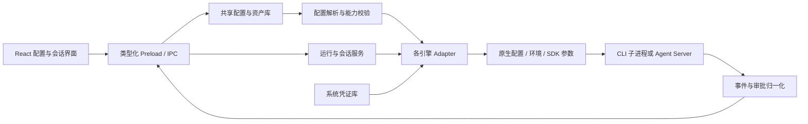

# 首批 CLI Agent 接入调研与配置架构建议

调研日期：**2026-09-17**。面向 AgentMatrix（Electron + React + TypeScript）。

范围：Claude Code、Codex CLI、OpenCode、Pi、Gemini CLI、OpenHands、Cline、Goose、DeepSeek Harness。依据官方文档、官方仓库 README 和必要的配置源码核查；**未安装、启动或调用这九个产品进行兼容性测试**。仓库默认分支的能力可能尚未进入已发布版本，实际接入必须绑定安装版本并探测能力。文中的“建议”是 AgentMatrix 的设计方案，不代表当前项目已经实现。

## 1. 核心结论

**采用“共享配置资源库 + Agent 配置档 + 每种引擎的适配器”架构。** 用户独立维护提示词、模型连接、凭证、MCP、Skills 和能力组合；每个 Agent 选择一个运行引擎，再绑定这些资源并配置该引擎的专属选项。

九个项目都能在其产品或 SDK 体系内定制系统指令、模型服务地址和认证，但入口、协议及作用范围不同。不能将它们理解为九个拥有相同 `systemPrompt / baseUrl / apiKey` 参数的命令行程序。

需要从第一版数据模型里区分五件事：

1. **引擎与模型服务不同。** Claude Code、Codex、Pi 是引擎；Anthropic、OpenAI、企业网关、Ollama 是模型服务。一个引擎可以连接多种服务，一个服务也可以供多个引擎使用。
2. **追加指令与替换系统提示词不同。** 项目规则、Skill、首轮任务、压缩提示词也应分别建模。它们不能通过拼接到第一条用户消息来等价实现。
3. **同一个 Base URL 不代表同一个协议。** 至少区分 Anthropic Messages、OpenAI Responses、OpenAI Chat Completions、Gemini 和 Vertex。协议、认证方式及模型工具调用能力都匹配后才能绑定。
4. **MCP 和 Skills 更适合跨引擎复用；可执行插件通常只能在自己的生态运行。** Pi 没有原生 MCP，必须通过扩展；不同项目的插件 manifest、生命周期和权限并不兼容。
5. **保存配置与让运行中的会话生效不同。** 有的配置只在启动时加载，有的下个请求生效，有的恢复会话仍沿用旧提示词。UI 应显示“已保存 / 待新会话生效 / 已应用”。

其中有两项应单独标记：用户给出的 OpenHands 主仓库目前是 **Agent Canvas**，其独立 V1 CLI 已声明不再积极维护；DeepSeek Harness 明确处于开发预览阶段，接口变化快。前者建议以 SDK / Agent Server 为长期接入对象，保留旧 CLI 兼容入口；后者采用实验性、固定版本的适配器。[OpenHands 主仓库][oh-main]、[CLI 状态][oh-cli]、[DeepSeek Harness][dsh-main]

## 2. 总体能力对照

### 2.1 指令与模型连接

“支持”仅表示存在官方入口；不表示任意模型、任意网关或所有已发布版本都兼容。详细限制见第 3 节。

| 引擎             | 系统指令入口                                                                                | 自定义 endpoint / key 入口                                                         | 必须保留的差异                                                                     |
| ---------------- | ------------------------------------------------------------------------------------------- | ---------------------------------------------------------------------------------- | ---------------------------------------------------------------------------------- |
| Claude Code      | `--append-system-prompt[-file]` 追加；`--system-prompt[-file]` 替换；`CLAUDE.md` 为项目指令 | `ANTHROPIC_BASE_URL`；`ANTHROPIC_API_KEY` 或 `ANTHROPIC_AUTH_TOKEN`                | 网关要匹配 Anthropic 协议；账号认证与 API key 分开；恢复会话有提示词快照语义       |
| Codex CLI        | `developer_instructions` 追加；`model_instructions_file` 替换基础指令；`AGENTS.md` 项目规则 | `model_providers.<id>.base_url / env_key / wire_api`                               | 当前参考配置的自定义 wire API 为 `responses`；不能直接拿 Chat Completions 网关替代 |
| OpenCode         | `agent.<name>.prompt`，支持 `{file:...}`；规则通过 `instructions` 等入口                    | `provider.<id>.options.baseURL / apiKey`，搭配 provider SDK 包                     | SDK 包决定协议；内置 Agent、自定义 Agent、模型路由和权限分别配置                   |
| Pi               | `SYSTEM.md` 或 `--system-prompt`；`APPEND_SYSTEM.md` 或 `--append-system-prompt`            | `models.json` 的 `providers.<id>.baseUrl / api / apiKey`                           | 多协议；替换核心提示词后仍可附加上下文和 Skills；环境变量插值语法有版本差异        |
| Gemini CLI       | `GEMINI_SYSTEM_MD` 全量替换；`GEMINI.md` 提供项目上下文                                     | `GOOGLE_GEMINI_BASE_URL` + `GEMINI_API_KEY`；Vertex 有独立入口                     | endpoint 与认证模式绑定；不是通用 OpenAI-compatible 客户端                         |
| OpenHands        | SDK `Agent.system_prompt` 或模板；`AgentContext.system_message_suffix` 追加                 | SDK `LLM(model, base_url, api_key)`；旧 CLI 的 `agent_settings.json`               | 旧 CLI 环境覆盖需 `--override-with-envs`；SDK 定制不能一概说成 CLI flag            |
| Cline            | CLI `--system`；规则目录；SDK `systemPrompt`                                                | provider settings 的 `baseUrl / apiKey / protocol` 等                              | 当前 CLI / SDK 与旧 IDE 配置格式有演进；不能照搬旧扩展设置                         |
| Goose            | `prompts/system.md` 模板覆盖；Recipe `instructions`、Hints 提供额外指令                     | provider 专属配置；OpenAI 示例为 `OPENAI_HOST / OPENAI_BASE_PATH / OPENAI_API_KEY` | host 与请求路径分离；API key 放普通 `config.yaml` 不会生效                         |
| DeepSeek Harness | `dsh-system-prompt` persona 前后缀；插件注册 `complete: true` 完整提示词                    | `llm-pi-ai.providers` 的 `baseURL / api / apiKeyEnv`；DeepSeek 原生适配器另有配置  | Cordis 插件组合决定能力；全量替换需插件接口，不能假设有通用 `--system-prompt`      |

依据：[Claude CLI][cc-cli] / [环境变量][cc-env]；[Codex 配置][cx-config]；[OpenCode Agents][oc-agents] / [Providers][oc-providers]；[Pi][pi-cli] / [Models][pi-models]；[Gemini Prompt][gm-prompt] / [配置][gm-config]；[OpenHands Agent][oh-agent] / [LLM][oh-llm]；[Cline CLI][cl-cli] / [Provider Schema][cl-provider]；[Goose Prompt][gs-prompt] / [Providers][gs-providers]；[DSH Prompt][dsh-prompt] / [Providers][dsh-providers]。

### 2.2 扩展与桌面运行接口

| 引擎             | MCP / Skills                                 | 原生扩展形式                                     | 建议的桌面集成入口                                                           |
| ---------------- | -------------------------------------------- | ------------------------------------------------ | ---------------------------------------------------------------------------- |
| Claude Code      | 原生 MCP；Skills                             | Claude 插件、Hooks、子 Agent 等                  | Agent SDK；或 `claude -p` 的双向 `stream-json`                               |
| Codex CLI        | 原生 MCP；Skills                             | Codex 插件、Skills、角色配置等                   | **`codex app-server`**：双向事件、审批、认证、会话；`exec --json` 用于批处理 |
| OpenCode         | 原生 MCP；Skills                             | JS/TS / npm 插件，自定义工具和 Agent             | `opencode acp`；或自身 server / SDK                                          |
| Pi               | **MCP 需扩展**；原生 Skills                  | TypeScript extensions；npm / git Pi packages     | **`pi --mode rpc`** 或 TypeScript SDK                                        |
| Gemini CLI       | 原生 MCP；Skills                             | Gemini extensions、Hooks、子 Agent 等            | **`gemini --acp`**；headless JSON 用于批处理                                 |
| OpenHands        | SDK / CLI 有 MCP；SDK 有 AgentSkills         | Python tools、Skills、插件、工作空间后端         | SDK / Agent Server；旧 CLI `openhands acp` 为兼容路径                        |
| Cline            | 原生 MCP；Skills                             | 当前 CLI / SDK 插件、Hooks、工作流               | **`cline --acp`** 或 `@cline/sdk`；`--json` 为结构化输出                     |
| Goose            | MCP 是主要扩展机制；Skills                   | 内置 / MCP extensions、Recipes、自定义 providers | **`goose acp`**；需要独立服务时 `goose serve`                                |
| DeepSeek Harness | 官方 MCP、Skills 插件，依赖 profile 实际装载 | Cordis 插件树、profiles、bundles                 | **`dsh --profile sdk`**；ACP 仅用于已覆盖的自动化能力                        |

依据：[Claude CLI][cc-cli]；[Codex App Server][cx-app] / [非交互模式][cx-exec] / [Skills][cx-skills]；[OpenCode ACP][oc-acp] / [配置][oc-config]；[Pi README][pi-cli] / [RPC][pi-rpc]；[Gemini ACP][gm-acp] / [Skills][gm-skills]；[OpenHands CLI][oh-cli] / [SDK][oh-sdk]；[Cline CLI][cl-cli] / [SDK][cl-sdk]；[Goose ACP][gs-acp] / [Skills][gs-skills]；[DSH CLI][dsh-cli] / [ACP 限制][dsh-acp]。

**MCP、ACP、JSON 输出是三个层面：** MCP 连接工具与资源；ACP 连接宿主 UI 与 Agent；JSON 输出只是序列化形式，未必支持双向审批、取消或会话恢复。某引擎提供 MCP server，不等于它能充当 AgentMatrix 所需的 MCP client。

## 3. 各项目的接入细节

### 3.1 Claude Code

**配置与指令。** 常见配置包括用户级 `~/.claude/settings.json`、项目级 `.claude/settings.json`、本地项目级 `.claude/settings.local.json`；组织管理配置具有更高约束。`--settings` 是覆盖指定字段的合并入口，并不自动隔离其他配置来源。[Settings][cc-settings]

系统提示词区分文本 / 文件的追加与替换入口。共享角色指令优先映射为追加；`CLAUDE.md` 保留为项目规范。当前文档还说明：恢复会话可能沿用首次请求记录的系统提示词，直到压缩或新建会话；较新版本的 `--system-prompt-snapshot off` 可改变此行为，因此“改文件后重启 CLI”不总等于“旧会话立刻换提示词”。[CLI 参考][cc-cli]

**模型连接。** `ANTHROPIC_BASE_URL` 指向支持所需 Anthropic 请求语义的服务；key 使用 `X-Api-Key`，`ANTHROPIC_AUTH_TOKEN` 使用 Bearer。应将二者建模为不同认证方式。Bedrock、Google Cloud、Foundry 等路线也有各自认证，不宜压缩为一个 API key 输入框。[环境变量][cc-env]

**MCP 与执行。** 可通过 `--mcp-config` 提供运行配置；`--strict-mcp-config` 可限制普通 MCP 配置来源，但管理策略仍需按官方规则处理。`--input-format stream-json` / `--output-format stream-json` 是程序化接入入口；具体输出及交互选项由版本对应的 CLI / SDK 管理。[CLI 参考][cc-cli]

**AgentMatrix 专属项：** permission mode、allowed / disallowed tools、配置来源选择、模型别名、预算、子 Agent、Hooks、插件及提示词快照策略。审批与沙箱分别呈现，不从提示词推导执行权限。

### 3.2 Codex CLI

**配置与指令。** 核心配置为 `$CODEX_HOME/config.toml`，通常位于 `~/.codex/`。当前官方样例把命名 profile 放在 `$CODEX_HOME/<name>.config.toml`；与旧版本常见的内嵌 profile 格式有差异，适配器应按安装版本读写。`developer_instructions` 用于补充指令，`model_instructions_file` 替换基础指令，`compact_prompt` 是另一种用途，不能混用。[样例][cx-config]、[参考][cx-reference]

**模型连接。** 自定义 provider 使用独立 ID，配置 `base_url`、`env_key`、`wire_api` 和必要的请求头；当前参考样例注明 `wire_api = "responses"`。内置 OpenAI 的地址覆盖另有 `openai_base_url`。不要把只提供 `/chat/completions` 的服务标为 Codex 原生兼容；网关是否满足流式事件、工具调用和模型要求还需验证。[Provider 配置][cx-config]

**桌面集成。** App Server 是官方面向自有产品深度集成的接口，可处理认证、历史、审批和流式事件。默认 stdio，客户端先 `initialize` / `initialized`，再管理 thread 和 turn；消息结构与常见 JSON-RPC 有细节差异，应使用该版本生成的 schema / 类型。`codex exec --json` 更适合任务型批处理。[App Server][cx-app]、[非交互模式][cx-exec]

**MCP / Skills。** MCP 放在 `[mcp_servers.<name>]`；支持本地进程、远程 HTTP 以及相应认证字段。Skills 是带 `SKILL.md` 的目录，项目和用户路径有专门发现规则；同名技能也未必按常见的“项目覆盖用户”处理。[MCP][cx-mcp]、[Skills][cx-skills]

**AgentMatrix 专属项：** 审批策略、文件系统 / 网络权限、reasoning effort、模型能力、web search、角色和多 Agent 配置。不要对不接受 temperature 的模型强制输出当前项目默认的 `0.7`。

### 3.3 OpenCode

**配置。** 使用 `opencode.json` / JSONC；用户级常见路径为 `~/.config/opencode/opencode.json`。配置按层合并。尤其要注意：`OPENCODE_CONFIG` 位于用户配置之后、项目配置之前，**指定该文件不等于最终覆盖项目配置**；`OPENCODE_CONFIG_CONTENT` 运行时覆盖也仍受管理配置约束。[配置及优先级][oc-config]

**指令与连接。** 自定义 Agent 的 `prompt` 可以引用文件；Agent 还有 model、temperature、mode、permission 等选项。模型为 `provider/model` 路由。自定义 provider 需要配套的 SDK 包，例如 `@ai-sdk/openai-compatible` 与 `@ai-sdk/openai` 对应的调用路径不同；地址字段是 `options.baseURL`，key 可通过 `{env:变量名}` 引用。[Agents][oc-agents]、[Providers][oc-providers]

**MCP。** 配置键为 `mcp`；本地类型用 `command` 数组把可执行文件和参数放在一起，环境字段叫 `environment`；远程使用 `url / headers / oauth` 等。必须由适配器转换，不能直接复制 AgentMatrix 的 `command: string, args: string[]` 对象。[MCP][oc-mcp]

**AgentMatrix 专属项：** primary / subagent 角色、工具级 permission、provider npm 包、自定义模型元数据、small model、插件和组织配置来源。桌面可先统一接 ACP，需要更丰富事件时再引入其 server / SDK。[ACP][oc-acp]、[配置][oc-config]

### 3.4 Pi

**对象确认。** 本次以用户给出的 `earendil-works/pi` 为准；coding-agent 包为 `@earendil-works/pi-coding-agent`，不要沿用历史仓库或包名推断当前能力。[仓库][pi-main]

**配置与指令。** 全局目录通常为 `~/.pi/agent/`，可用 `PI_CODING_AGENT_DIR` 覆盖；包含 `settings.json`、`models.json`、认证等文件，项目配置在 `.pi/`。`SYSTEM.md` 替换、`APPEND_SYSTEM.md` 追加，CLI 也提供对应参数；`--system-prompt` 替换默认部分时，上下文文件和 Skills 仍可能被附加。[CLI][pi-cli]、[环境变量][pi-env]

**模型连接。** `models.json` 提供 `baseUrl / api / apiKey`。协议支持 OpenAI、Anthropic、Google 等，但每项仍需声明正确的 API 类型。当前文档的 key 引用使用 `$MY_API_KEY` 等插值语法，并支持命令取值；AgentMatrix 应默认使用凭证引用，不能在导入配置时自动执行 `!command`。无认证本地服务可能仍需要 Pi 的占位 key，应由适配器处理为非秘密兼容值。[Models][pi-models]

**两项关键限制。** Pi 明确没有内建 MCP，也没有通用工具权限弹窗；MCP 和确认流程可由 extensions 补充。当前版本的“项目信任”控制项目资源加载，不能等同于文件系统 / 网络沙箱。[CLI 的扩展与设计说明][pi-cli]、[仓库安全边界][pi-main]

**AgentMatrix 专属项：** extensions、Pi packages、工具集、项目信任、thinking level、上下文压缩等。首选 RPC 或 SDK；RPC 使用严格以 LF 分隔的 JSONL，不能随意按其他 Unicode 换行符切分。[RPC][pi-rpc]

### 3.5 Gemini CLI

**配置与指令。** 用户 / 项目配置常见于 `~/.gemini/settings.json`、`.gemini/settings.json`。`GEMINI_CLI_HOME` 指向其用户数据根目录，CLI 会在其中创建 `.gemini` 子目录，不能误当成直接的 settings 目录。[配置][gm-config]

`GEMINI_SYSTEM_MD=/绝对路径/system.md` 完整替换核心提示词；`true` / `1` 指向项目 `.gemini/system.md`。`GEMINI.md` 则承载项目和角色上下文。替换模板还支持工具、Skills 等变量，不能把默认模板中的变量无条件删除。[System Prompt][gm-prompt]

**模型连接。** API key 模式使用 `GEMINI_API_KEY` 和 `GOOGLE_GEMINI_BASE_URL`；Vertex 使用独立的 `GOOGLE_VERTEX_BASE_URL` 及其认证、project / location 配置。OAuth 登录路线也应单独建模。自定义地址能力不等于支持 OpenAI Chat Completions。[配置][gm-config]

**扩展与运行。** 原生支持 MCP、Agent Skills 和 ACP。第一版优先 `gemini --acp`，单次自动化可使用 headless 模式；stdio / SSE / HTTP 等 MCP 字段按当前 schema 映射，不能只改名称就转换传输类型。[MCP][gm-mcp]、[Skills][gm-skills]、[ACP][gm-acp]、[Headless][gm-headless]

**AgentMatrix 专属项：** 认证路线、云项目与区域、approval mode、sandbox、policy、extensions、上下文发现和可用子 Agent。

### 3.6 OpenHands

**必须拆开产品层。** `OpenHands/OpenHands` 现在主要是 Agent Canvas 控制界面；真正的 Agent 能力在 software-agent-sdk / Agent Server 等组件。独立 `OpenHands-CLI` README 已明确不再积极维护。因此一个笼统的 `openhands` 引擎 ID 不足以描述版本与运行方式。[主仓库][oh-main]、[CLI][oh-cli]

建议区分 `openhands-sdk`（长期接入）和 `openhands-cli-legacy`（兼容），二者在界面上仍可归到 OpenHands 品牌下。

**System Prompt 与模型连接。** 当前 SDK 的 `Agent` 支持 `system_prompt` 内联替换，以及 `system_prompt_filename / system_prompt_kwargs` 模板方式；`AgentContext.system_message_suffix` 是追加入口。`LLM` 提供 `model / base_url / api_key`。这些是已核查的 SDK 字段，不应宣传为所有旧 CLI 均支持的命令行参数。[Agent][oh-agent]、[AgentContext][oh-context]、[LLM][oh-llm]

**旧 CLI。** 使用 `~/.openhands/agent_settings.json`、`cli_config.json`、`mcp.json`。`LLM_API_KEY / LLM_MODEL / LLM_BASE_URL` 默认被忽略，需 `--override-with-envs`，且覆盖不持久化。`--headless -f file` 读取任务输入，并非设置系统提示词。它提供 ACP 和 headless JSON，可以作为过渡入口。[CLI][oh-cli]

**扩展与专属项。** SDK 有 MCP tools、AgentSkills、插件及 marketplace 示例。工具、workspace 后端、Agent Server、condenser、critic 和 confirmation policy 应留作专属配置；远程或容器内运行时还要转换资源路径。[SDK][oh-sdk]、[Skills 示例][oh-skills]、[插件示例][oh-plugins]

### 3.7 Cline

**对象确认。** 当前主仓库已有 `apps/cli` 和 `@cline/sdk`，不应把 Cline 仅当作 VS Code 扩展。CLI 支持 `--system` 覆盖默认提示词，`--provider / --model` 选择连接，`--acp` 程序化通信，`--json` 输出结构化消息。[CLI][cl-cli]、[CLI README][cl-readme]

**配置。** 当前文档的 provider、global settings、MCP 配置位于 `~/.cline/data/settings/`；项目资源位于 `.cline/`。CLI 的 `--config` 指向配置目录，`--data-dir` 用于隔离本地状态，两者语义不同。全局 / 项目规则、Skills、Hooks 和插件还各有搜索路径。[配置][cl-config]

**模型连接。** 当前源码的 `ProviderSettings` 包含 `provider / model / protocol / baseUrl / apiKey / auth / headers` 等；协议枚举包括 `openai-chat`、`openai-responses`、`anthropic`、`gemini` 等。`providers.json` 又有版本、providers 和 entry settings 外层，不能将一段裸 ProviderSettings 当整个文件写入。优先 SDK / 配置服务；不要依赖未核查的通用 `--base-url` flag，也不要沿用旧版 IDE 的平铺字段。[Provider Schema][cl-provider]、[存储 Schema][cl-storage]

**审批差异。** 当前 CLI 参考写明普通运行的 `--auto-approve` 默认开启，ACP 模式默认关闭。AgentMatrix 启动时必须显式应用用户所选策略，不能依赖所有 CLI 默认都询问用户。[CLI][cl-cli]

**AgentMatrix 专属项：** Plan / Act、thinking、retries、auto approval、命令权限、Hooks、工作流、插件、hub / session backend。Skills 的发现与同名优先级也要按 Cline 处理。[Skills][cl-skills]

### 3.8 Goose

**配置与指令。** macOS / Linux 常见配置为 `~/.config/goose/config.yaml`；当前 provider 存储结构是 `active_provider` + `providers`，旧的扁平字段属于兼容格式。`GOOSE_PROVIDER / GOOSE_MODEL` 仍可作为环境覆盖。`GOOSE_PATH_ROOT` 可隔离 config / data / state 根目录。[配置][gs-config]、[环境变量][gs-env]

覆盖 `prompts/system.md` 可定制系统模板；模板使用 Jinja 风格变量，应保留必要工具 / 扩展描述。Recipe 的 `instructions` 与 `prompt` 分别表达运行指令和任务输入，不能都归到 System Prompt。模板修改通常在新会话生效。[Prompt Templates][gs-prompt]、[Recipes][gs-recipes]

**模型连接。** 以 OpenAI-compatible 为例，`OPENAI_HOST` 是服务根地址，`OPENAI_BASE_PATH` 是附加路径，通常为 `v1/chat/completions`。key 从环境或 secret storage 获取，放进普通 `config.yaml` 会被忽略；其他 provider 使用各自的字段。[Providers][gs-providers]

**MCP / Skills / 运行。** MCP extensions 当前支持 stdio 和 Streamable HTTP；配置文档明确不支持旧 SSE。Skills 推荐 `.agents/skills` 系列路径。桌面可启动 `goose acp`；`goose serve` 支持远程连接但需相应认证设置。[配置][gs-config]、[Skills][gs-skills]、[ACP][gs-acp]

**AgentMatrix 专属项：** Recipes、extension 类型、工具过滤、`GOOSE_MODE`、上下文压缩、provider 和模型元数据。Goose 还可把另一个 CLI 作为 ACP provider；这属于嵌套 Agent 路线，应单独显示实际执行链，避免用户误以为只是更换模型 API。[Providers][gs-providers]

### 3.9 DeepSeek Harness

**对象确认。** 它是 Cordis 插件化 harness，命令为 `dsh`，不是给任意 CLI 填一个 DeepSeek API 地址。官方标明开发预览；本次结论绑定文末源码快照。[仓库][dsh-main]

**配置。** `$DSH_HOME` 默认对应 `~/.dsh`。可变模型设置在 `settings.yaml`，凭证服务使用独立 `.credentials.yaml`；profile 在 `profiles/<name>`，通过 `package.json` 的 `dsh.profile` 和 `cordis.patch.yml` 组合插件。`--patch`、profile 与 home patch 有自己的优先级；只有配置为 live reload 的 profile 才自动重载对应 patch。[Providers][dsh-providers]、[CLI][dsh-cli]

**系统提示词。** `dsh-system-prompt` 提供 `personaPrefix / personaSuffix`、运行上下文和工具顺序。插件可注册 scoped section；一个有效 `complete: true` section 才表示完整提示词，多份 complete 会报错。因此共享追加指令与全量替换要走不同适配路径。[System Prompt][dsh-prompt]

**模型连接。** 通用模型层的自定义 provider 使用 `baseURL / api / apiKeyEnv`；当前用户界面列出 `openai-completions`、`openai-responses`、`anthropic-messages`。DeepSeek 原生适配器有独立 `deepseek-official` 路由、协议和 reasoning 选项；不能与通用 provider 混为同一套配置。当前通用 provider 设置页尚不支持 OAuth provider。[Providers][dsh-providers]、[原生适配器][dsh-llm]

**运行与限制。** `dsh --profile sdk` 提供 SDK JSON-RPC；`--profile headless` 为单次任务；`--profile acp` 支持自动化。但 ACP 文档明确不提供完整 DSH 卡片、计划、终端、elicitation 等交互能力，支持 resume 也不表示支持历史事件回放。完整桌面体验应评估 SDK 入口。[CLI][dsh-cli]、[ACP][dsh-acp]

**AgentMatrix 专属项：** profile / bundle / patch、Cordis 插件参数、permission preset、sandbox backend、persona、工具呈现和 provider reasoning。MCP / Skills 是官方组件，但精简 profile 可能未装载，需查询有效能力。[MCP][dsh-mcp]、[Skills][dsh-skills]、[配置目录][dsh-catalog]

## 4. 哪些内容统一维护，哪些内容个性化配置

| 配置资产   | 统一维护什么                                                     | 个性化保留什么                                        | 不支持时的行为                                   |
| ---------- | ---------------------------------------------------------------- | ----------------------------------------------------- | ------------------------------------------------ |
| 模型连接   | 名称、服务 URL、协议、认证引用、非敏感 headers                   | provider ID、SDK 包、云区域、路由参数、路径拼接       | 阻止不兼容绑定；显示缺失协议 / 功能              |
| 模型档案   | 模型 ID、连接引用、人工确认的能力与限制                          | reasoning 枚举、模型别名、缓存选项、provider 特有参数 | 不输出未知参数，不静默改模型                     |
| Prompt     | Markdown 正文、版本、用途、适用范围                              | append / replace 的入口、模板变量、原生层级           | 缺少精确映射时明确提示，不能改为普通任务输入     |
| 项目规则   | 可共享的项目约定、适用目录                                       | `CLAUDE.md / AGENTS.md / GEMINI.md` 等及层级规则      | 生成预览；已有用户文件不直接覆盖                 |
| MCP Server | command + args、cwd、环境引用；URL、headers、认证与超时          | 原生键名、OAuth 流程、工具过滤、支持的 transport      | Pi 标注“需扩展”；SSE 不自动冒充 HTTP             |
| Skill      | 完整目录、`SKILL.md`、frontmatter、脚本 / references、版本与来源 | 搜索路径、额外 frontmatter、激活和同名冲突规则        | 给出降级说明；纯文本导出不标为原生 Skill         |
| 能力组合   | 一组 Prompt / MCP / Skills 引用                                  | 可选的、按引擎区分的原生插件依赖                      | 显示哪些资源可复用、哪些原生插件不可用           |
| 执行策略   | 工作目录、环境、超时、并发限制、期望审批策略                     | 沙箱实现、文件 / 网络策略、命令过滤、自动审批语义     | 无法满足所选约束则阻止启动或要求更换配置         |
| 会话       | 标题、引擎 ID、原生 session ID、状态、统一事件索引               | 原生 transcript、resume / fork / compact 语义         | 只能做“带摘要的新会话”时明确标识，不伪装原生迁移 |

**统一配置的是用户意图和资源内容，不是强行统一原生文件格式。** 例如同一个“代码评审指令”可以被 Claude 作为 append prompt、Codex 作为 developer instructions、OpenHands 作为 context suffix 使用；都能复用正文，但其指令优先级和运行时上下文不保证相同。

## 5. 推荐的数据模型

### 5.1 核心实体

| 实体                       | 关键字段 / 职责                                                                                                |
| -------------------------- | -------------------------------------------------------------------------------------------------------------- |
| `EngineInstallation`       | 引擎类型、可执行文件绝对路径、版本、启动前缀参数、运行平台、支持的协议、探测时间                               |
| `ModelConnection`          | `protocol`、`baseUrl`、认证策略、`credentialRef`、普通 / secret headers、cloud options；同一连接只对应一种协议 |
| `ModelProfile`             | `connectionId`、`modelId`、可选采样 / reasoning、上下文与模态能力、能力信息来源                                |
| `Credential`               | 显示名、类型、系统凭证库引用；渲染层只能得到已配置状态和脱敏元信息                                             |
| `PromptAsset`              | 内容或文件资产、用途（角色指令 / 项目规则 / 系统模板 / 压缩模板）、内容版本                                    |
| `McpServerDefinition`      | 可区分的 stdio / Streamable HTTP / legacy SSE 结构；不同认证方式；工具过滤                                     |
| `SkillAsset`               | 目录资产与 digest、frontmatter、来源、版本、附属文件、支持的引擎与转换限制                                     |
| `CapabilityBundle`         | 跨引擎可复用的资源 ID 集合，对应当前项目“插件组合”的定位                                                       |
| `NativePluginInstallation` | 特定引擎的插件 ID、来源、版本、安装位置和配置；与资源组合分开                                                  |
| `AgentProfile`             | 名称、engineInstallationId、modelProfileId、Prompt / MCP / Skills / Bundle 绑定、专属 options                  |
| `RunSnapshot`              | 启动时解析后的资源版本、引擎版本、有效配置摘要、原生 session ID、运行事件；不含明文凭证                        |

认证策略至少应区分 `api-key`、`bearer`、`engine-login`、`cloud-identity`、`none`。自动刷新的订阅 / OAuth 凭证尽量由原生引擎维护，不能把用户登录令牌复制成“公共 API key”。同一个 credential 可被多个连接引用，但传递到哪个 host、以什么 header 发送，由连接显式决定。

字段 `temperature`、`topP`、`reasoning` 都应可缺省。不同引擎与模型的取值范围和组合限制不同，不能维护一个全局必填值并无条件下发。

### 5.2 Agent 配置档示意

下面是 **AgentMatrix 设计草案，不是任何 CLI 的原生配置，也不是当前项目 schema**：

```json
{
  "id": "reviewer-codex",
  "name": "代码评审助手",
  "engineInstallationId": "codex-local",
  "modelProfileId": "company-review-model",
  "promptBindings": [
    {
      "assetId": "review-instructions",
      "mode": "append",
      "follow": "latest"
    }
  ],
  "mcpBindings": [{ "serverId": "team-docs", "enabled": true }],
  "skillBindings": [{ "skillId": "review-checklist", "version": "1.0.0" }],
  "bundleIds": [],
  "nativePluginIds": [],
  "launch": {
    "cwd": "/path/to/project",
    "configMode": "managed-profile"
  },
  "engineOptions": {
    "codex": {
      "approvalPolicy": "on-request"
    }
  }
}
```

同一 `review-instructions` 可再绑定一个 Claude 或 Gemini 配置档。共享正文更新后，“跟随最新”的新运行使用新版本；“固定版本”的配置档保持不变。每次运行都记录最终 digest，确保能够解释那次任务实际用了哪份指令。

这里的 `append` 是统一的**行为意图**。适配器要记录 `nativePromptTarget`、原生层级和应用时机；比如 Gemini 的项目上下文不应在 UI 里被描述为与 Claude append flag 完全相同的底层语义。

### 5.3 能力清单必须可查询

按“引擎 + 版本 + 模式 + 当前 profile”计算 capability descriptor。至少包含：

- Prompt：追加 / 替换 / 项目规则入口、作用层级、模板语法、何时生效。
- Model：支持协议、认证路线、允许覆盖的 endpoint、可设置的参数。
- MCP：native / extension / unsupported、transport、OAuth、工具过滤、能否热更新。
- Skills / Plugins：发现目录、装载模式、扩展字段、是否执行代码。
- Runtime：ACP / RPC / SDK、审批、取消、恢复、会话列表、分叉、事件回放。
- Isolation：进程 / 容器 / 远端、文件系统与网络边界、是否能限制工具子进程。

状态不能只有一个布尔值。建议使用 `native / adapter / extension-required / unsupported / unverified`，并附 `constraints` 与证据来源；只有经过安装版本验证后，才能从“文档支持”升级为“已验证可用”。

## 6. Electron 接入架构



保留当前工程的主进程 / preload 边界。主进程或 utility process 管理凭证、文件、子进程；渲染进程不拿任意 shell 或文件写入权限。

适配器至少负责以下流程：

| 阶段                        | 输出                                                                 |
| --------------------------- | -------------------------------------------------------------------- |
| `probe`                     | 安装路径、版本、模式和实际 capability                                |
| `inspect`                   | 读取现有配置的脱敏结果及来源，不隐式修改                             |
| `validate`                  | 不兼容协议、缺失资源、未知字段、权限不可满足等诊断                   |
| `plan`                      | 将写入哪些受管理文件、原生字段如何映射、启动命令预览、哪些内容被覆盖 |
| `materialize`               | 生成该引擎可读取的配置 / Prompt / Skills，保存 manifest 和内容摘要   |
| `launch`                    | 以参数数组启动子进程，注入该运行所需的环境；或建立 SDK / 服务连接    |
| `observe`                   | 转换消息增量、工具状态、审批、错误、用量、完成事件；保留原始事件类型 |
| `cancel / resume / dispose` | 使用原生协议取消与恢复，释放进程和临时资源，处理异常退出             |

归一化事件保留 `rawEvent` 或版本化原始日志的引用；各引擎缺失的 cost、tokens、tool status 显示为未知，不能补零。审批响应只完成对应原生请求；不支持可靠双向审批的批处理模式不能冒充完整交互会话。

优先复用 ACP 的客户端基础设施，但每个引擎仍有配置和能力适配。Codex 用 App Server，Pi 用原生 RPC，OpenHands 用 SDK / Agent Server，DSH 根据体验要求选择 SDK 或受限 ACP。PTY 仅作为保留原生终端体验的兜底；解析 ANSI 输出不应成为工具调用和审批状态的主要来源。

## 7. 动态维护与配置分发

### 7.1 维护三种视图

- **共享资产**：Prompt、模型连接、MCP、Skill 的原始内容和版本。
- **Agent 绑定**：引用哪些资产、覆盖哪些参数、采用哪些专属选项。
- **有效配置**：此次运行真正加载的资源、原生配置来源、冲突项和生效版本。

界面建议：左侧共享资源库；中间 Agent 列表；右侧为“通用配置 / 引擎专属配置 / 有效配置预览 / 诊断”。专属字段由带版本的 schema 驱动，不把高级 JSON 文本框作为唯一入口。

### 7.2 两种配置管理方式

**托管配置档。** AgentMatrix 为每个引擎 / profile 生成自己的资源目录，优先使用官方支持的 config home、config file 或 SDK 参数。不改写系统 `HOME` 来假装隔离，因为这会影响认证、Git、SSH、包管理器和工具子进程。指定配置目录也不保证不会继续加载项目 / 管理配置，适配器必须说明实际来源。

**接管现有配置。** 先只读导入，保留未知字段和来源；编辑时显示 diff、保存备份、使用原生格式支持的结构化写入。文件变化要做 hash / revision 冲突检测，不能盲目双向覆盖。项目规则文件属于用户内容，默认生成单独片段或通过原生入口引用。

托管文件建议位于 `userData/engines/<installationId>/profiles/<profileId>/`，运行快照位于 `userData/runs/<runId>/`。具体布局是 AgentMatrix 内部约定，由 adapter 映射为引擎期望的路径。

### 7.3 更新的生效规则

| 更新                     | AgentMatrix 默认处理                                               |
| ------------------------ | ------------------------------------------------------------------ |
| 共享 Prompt / Skill 修改 | 保存新版本，显示受影响 Agent；新运行应用，旧会话按引擎能力处理     |
| endpoint / model 修改    | 校验协议、模型与认证绑定；新运行采用新连接；支持会话切换时显式应用 |
| key 轮换                 | 更新凭证引用所指内容；根据引擎是否缓存认证决定刷新或重启           |
| MCP 增删或参数变化       | 新会话默认生效；仅在原生支持时断开 / 重连，显示连接失败            |
| 原生插件升级             | 固定来源 / 版本，检查 schema 与依赖；不当作普通 Markdown 修改      |
| 外部编辑原生配置         | 重新读取并展示冲突，让用户选择导入或保留托管版本                   |

不要为了“实时”而强制在任务中途重启 CLI。默认将会影响执行的变更排队到下一轮或新会话；具备明确更新协议的引擎再开放实时应用。Claude 的提示词快照、Goose 的新会话模板、DSH 的按请求 / profile 重载说明，都表明各引擎的生效时机不同。[Claude CLI][cc-cli]、[Goose Templates][gs-prompt]、[DSH Providers][dsh-providers] / [CLI][dsh-cli]

### 7.4 凭证与执行边界

凭证通过系统凭证库保存，普通 workspace JSON 只存引用。编辑界面允许写入 / 替换 key，但保存后只返回脱敏状态；运行日志、命令预览、导出包均脱敏。用进程环境或 SDK 认证入口注入，不把明文 key 拼到 CLI 参数或 shell 命令里；确需原生落盘时，应按适配器声明处理受限文件和清理策略。

仅给子进程注入所需环境，不能把全部 provider key 全量共享给每个 Agent。需要注意：若 CLI 会把自身环境继承给其 shell tools，仅仅从主进程改为子进程注入并不能实现工具级密钥隔离；有此需求时另用受控网关或原生隔离机制。

权限页面分别表达“工具是否允许”“是否需要人类审批”“文件 / 网络是否由沙箱限制”。自定义 Prompt 不能代替这些机制，Pi 的 project trust 和其他 CLI 的 Plan mode 也不能普遍解释成操作系统只读沙箱。

## 8. 对当前 AgentMatrix 初始化代码的影响

本次只新增调研和设计文档，下面均为下一步建议。当前工程的真实边界见 [架构约定](architecture.md) 和 [README](../README.md)。

| 当前结构                                           | 问题                                                         | 建议                                                         |
| -------------------------------------------------- | ------------------------------------------------------------ | ------------------------------------------------------------ |
| `Agent.provider` 为三个模型提供方枚举              | 无法表达“Claude Code / Codex / Pi”等 CLI，也不能区分连接实例 | 新增 engine installation 与 model connection，Agent 分别引用 |
| `model / baseUrl / temperature` 直接放在 Agent     | 多 Agent 重复维护；temperature 必填会误下发                  | 抽出 `ModelProfile`，参数可缺省、按能力验证                  |
| `systemPrompt: string`                             | 无版本和共享引用，无法区分追加、替换、项目规则               | 抽出 PromptAsset + PromptBinding，保留正文迁移               |
| `McpServer` 仅两种 transport，HTTP 只有 bearer env | 缺 OAuth、headers、cwd、超时及原生兼容诊断                   | 扩展 discriminated union，标注 legacy SSE 能力；按需增加字段 |
| `Skill.instructions` + `sourcePath`                | 尚未读取目录，丢失 frontmatter 和脚本 / references           | 引入完整目录资产，保留简单 Markdown 为轻量类型               |
| `Plugin` 是 MCP / Skills 组合                      | 与各 CLI 的可执行插件同名，容易误解                          | 作为 CapabilityBundle；另加 NativePluginInstallation         |
| 无 CLI runtime                                     | 不能执行、取消、恢复或处理审批                               | 新增 engine adapter 与 session service；使用原生 agent loop  |
| 仅环境变量名引用                                   | 尚无统一模型凭证库                                           | 新增 Credential 服务，主进程解析引用                         |

建议新增的模块边界：

```text
src/shared/engines/           引擎、连接、资源绑定、能力和事件类型
src/main/credentials/        凭证库和脱敏
src/main/assets/             Prompt / Skill 目录、版本、导入导出
src/main/engines/adapters/   九类引擎配置转换与运行接口
src/main/engines/config/     配置计划、分发、diff、冲突检测
src/main/sessions/           会话与审批、取消、日志和快照
```

迁移时提升 `schemaVersion`，保持旧 workspace 备份。已有 `systemPrompt` 可迁移为资产，但旧数据没有表达引擎及 append / replace 意图，因此应标记为“待选择引擎 / 绑定方式”，不能擅自把旧“通用助手”改成某个 CLI。旧 `provider / baseUrl / model` 转换成待确认协议的连接和模型档案；原有插件资源引用继续保留。

这也调整了原初始化文档中的后续方向：在本轮明确的多 CLI 目标下，先建立 **CLI engine adapter → session service → UI**；若以后加入 AgentMatrix 自研 Agent，再单独建设直接调用模型的 provider loop，避免把第三方 CLI 又套入一套重复的 agent loop。

## 9. 分阶段落地与验收

### 9.1 推荐顺序

| 阶段            | 范围                                                                   | 交付结果                                                                 |
| --------------- | ---------------------------------------------------------------------- | ------------------------------------------------------------------------ |
| A：统一配置基础 | 九类引擎登记、共享资源、凭证引用、capability、专属 schema              | 可创建配置档、查看兼容性、预览导出；不把未连接状态显示为运行成功         |
| B：首批运行闭环 | Claude Code、Codex、OpenCode                                           | 覆盖 stream-json / App Server / ACP 三类入口，跑通消息、审批、取消、恢复 |
| C：扩充接口复用 | Gemini、Cline、Goose，再接 Pi RPC                                      | 复用 ACP 客户端并验证差异；Pi MCP 作为明确的可选扩展能力                 |
| D：专门适配     | OpenHands SDK / Agent Server；DeepSeek Harness SDK，必要时旧 CLI / ACP | OpenHands 处理 Python / 服务生命周期；DSH 固定版本并标记实验状态         |

这是按接口复用与维护风险提出的工程顺序，不是对模型效果或产品优劣的排名。九个引擎都可以先在配置层支持；完整运行能力应逐个通过验收后开启。

### 9.2 每个适配器的验收清单

1. 安装检测识别真实版本；没有可执行文件、未知版本、旧 schema 时有明确诊断。
2. 相同共享 Prompt 绑定两个引擎，各自生成正确原生字段；验证追加 / 替换 / 项目规则区别。
3. API endpoint、key header 和协议正确；将 Chat Completions-only 网关绑定到 Responses 路线时能提前阻止或明确报错。
4. MCP stdio 参数不经过 shell 二次解释；HTTP / OAuth 路线和不支持 transport 有明确结果；Pi 无扩展时不假装已连接。
5. Skills 保留目录与引用文件，验证发现、启停、同名冲突和按需加载；原生插件只装到相应引擎。
6. 普通日志和配置导出不含 key；多个运行之间的环境、资源和配置不串用。
7. 处理文本流、工具事件、审批拒绝、取消、进程异常和恢复；不依赖 CLI 默认自动审批值。
8. 共享资源修改后能准确显示旧会话与新会话版本；已有项目规则和用户配置不被覆盖。
9. 用固定 fixture / fake CLI 验证映射和生命周期，再对明确版本做真实 CLI 冒烟；需要模型调用的验证单独记录服务、模型和执行日期。

### 9.3 本次未解决、接入前需验证的事项

- 各机器实际安装版本与默认分支能力之间的差距，尤其 Codex profile、Cline schema、DSH profiles 的演进。
- 具体网关的 Responses / Messages 流式事件、工具调用、图像和模型 ID 是否真的兼容；“能列出模型”不是充分证明。
- 选择哪个 Pi MCP 扩展，以及扩展自己的协议覆盖、权限和维护状况。本次未把任何第三方扩展当作已验证依赖。
- OpenHands SDK / Agent Server 对本应用所需事件、审批和工作空间生命周期的完整覆盖；旧 CLI 仅保留兼容定位。
- DSH SDK 的具体版本契约；其 ACP 已知缺失的 UI 能力不能由通用 ACP 客户端凭空补出。
- Windows / macOS / Linux 的路径、进程树终止、系统凭证库、沙箱与原生插件依赖，需要分别验证。

## 10. 来源与版本记录

本文优先采用官方配置参考和当前源码；入口链接为用户提供的九个项目。Claude / Codex 使用在线官方文档，GitHub 项目使用下面的固定提交快照。**提交日期或默认分支状态不等于稳定发布版支持承诺。** 各段中的链接指向支撑对应结论的具体页面或源码。

| 官方来源                                                                                      | 调研基线                                                                                                                   |
| --------------------------------------------------------------------------------------------- | -------------------------------------------------------------------------------------------------------------------------- |
| [Claude Code Quickstart](https://code.claude.com/docs/zh-CN/quickstart) 与官方配置 / CLI 文档 | 在线文档，访问于 2026-09-17                                                                                                |
| [Codex CLI](https://learn.chatgpt.com/docs/codex/cli) 与官方配置 / App Server 文档            | 在线文档，访问于 2026-09-17                                                                                                |
| [anomalyco/opencode](https://github.com/anomalyco/opencode)                                   | `dev` / [`88c6c7abc7f3`](https://github.com/anomalyco/opencode/tree/88c6c7abc7f320b6aabed2634ac0b2d6e6ecea67)              |
| [earendil-works/pi](https://github.com/earendil-works/pi)                                     | `main` / [`509ee2bd0ba9`](https://github.com/earendil-works/pi/tree/509ee2bd0ba9fc3d31fb96fe8f5a6ef73b51833c)              |
| [google-gemini/gemini-cli](https://github.com/google-gemini/gemini-cli)                       | `main` / [`6a466a7e2fe2`](https://github.com/google-gemini/gemini-cli/tree/6a466a7e2fe2b1255752c1e74f69b31f0216084d)       |
| [OpenHands/OpenHands](https://github.com/OpenHands/OpenHands)                                 | `main` / [`f2b0aacda17f`](https://github.com/OpenHands/OpenHands/tree/f2b0aacda17fc60ea2ea45cfdd2323c12b034b7d)            |
| [OpenHands/OpenHands-CLI](https://github.com/OpenHands/OpenHands-CLI)                         | `main` / [`954f2ba646e8`](https://github.com/OpenHands/OpenHands-CLI/tree/954f2ba646e8d749261a8f2b2b7e3031fa39be9f)        |
| [OpenHands/software-agent-sdk](https://github.com/OpenHands/software-agent-sdk)               | `main` / [`3103fff8d33d`](https://github.com/OpenHands/software-agent-sdk/tree/3103fff8d33d9d52abd4eea18ff9a50d31de0468)   |
| [cline/cline](https://github.com/cline/cline)                                                 | `main` / [`d6d456645128`](https://github.com/cline/cline/tree/d6d45664512852a56e59d3e8538c72a3adc94ae1)                    |
| [aaif-goose/goose](https://github.com/aaif-goose/goose)                                       | `main` / [`db9f67c06307`](https://github.com/aaif-goose/goose/tree/db9f67c063075f7efb52ac80723a23dc70964c94)               |
| [deepseek-ai/deepseek-harness](https://github.com/deepseek-ai/deepseek-harness)               | `master` / [`0d1f50007f9b`](https://github.com/deepseek-ai/deepseek-harness/tree/0d1f50007f9bca3f52b06e1c3074fa14d5fb0720) |

[cc-cli]: https://code.claude.com/docs/en/cli-reference
[cc-env]: https://code.claude.com/docs/en/env-vars
[cc-settings]: https://code.claude.com/docs/en/settings
[cx-config]: https://learn.chatgpt.com/docs/config-file/config-sample
[cx-reference]: https://learn.chatgpt.com/docs/config-file/config-reference
[cx-app]: https://learn.chatgpt.com/docs/app-server
[cx-exec]: https://learn.chatgpt.com/docs/non-interactive-mode
[cx-mcp]: https://learn.chatgpt.com/docs/extend/mcp
[cx-skills]: https://learn.chatgpt.com/docs/build-skills
[oc-config]: https://github.com/anomalyco/opencode/blob/88c6c7abc7f320b6aabed2634ac0b2d6e6ecea67/packages/web/src/content/docs/config.mdx
[oc-agents]: https://github.com/anomalyco/opencode/blob/88c6c7abc7f320b6aabed2634ac0b2d6e6ecea67/packages/web/src/content/docs/agents.mdx
[oc-providers]: https://github.com/anomalyco/opencode/blob/88c6c7abc7f320b6aabed2634ac0b2d6e6ecea67/packages/web/src/content/docs/providers.mdx
[oc-mcp]: https://github.com/anomalyco/opencode/blob/88c6c7abc7f320b6aabed2634ac0b2d6e6ecea67/packages/web/src/content/docs/mcp-servers.mdx
[oc-acp]: https://github.com/anomalyco/opencode/blob/88c6c7abc7f320b6aabed2634ac0b2d6e6ecea67/packages/web/src/content/docs/acp.mdx
[pi-main]: https://github.com/earendil-works/pi/blob/509ee2bd0ba9fc3d31fb96fe8f5a6ef73b51833c/README.md
[pi-cli]: https://github.com/earendil-works/pi/blob/509ee2bd0ba9fc3d31fb96fe8f5a6ef73b51833c/packages/coding-agent/README.md
[pi-env]: https://github.com/earendil-works/pi/blob/509ee2bd0ba9fc3d31fb96fe8f5a6ef73b51833c/packages/coding-agent/docs/environment-variables.md
[pi-models]: https://github.com/earendil-works/pi/blob/509ee2bd0ba9fc3d31fb96fe8f5a6ef73b51833c/packages/coding-agent/docs/models.md
[pi-rpc]: https://github.com/earendil-works/pi/blob/509ee2bd0ba9fc3d31fb96fe8f5a6ef73b51833c/packages/coding-agent/docs/rpc.md
[gm-prompt]: https://github.com/google-gemini/gemini-cli/blob/6a466a7e2fe2b1255752c1e74f69b31f0216084d/docs/cli/system-prompt.md
[gm-config]: https://github.com/google-gemini/gemini-cli/blob/6a466a7e2fe2b1255752c1e74f69b31f0216084d/docs/reference/configuration.md
[gm-skills]: https://github.com/google-gemini/gemini-cli/blob/6a466a7e2fe2b1255752c1e74f69b31f0216084d/docs/cli/skills.md
[gm-acp]: https://github.com/google-gemini/gemini-cli/blob/6a466a7e2fe2b1255752c1e74f69b31f0216084d/docs/cli/acp-mode.md
[gm-mcp]: https://github.com/google-gemini/gemini-cli/blob/6a466a7e2fe2b1255752c1e74f69b31f0216084d/docs/tools/mcp-server.md
[gm-headless]: https://github.com/google-gemini/gemini-cli/blob/6a466a7e2fe2b1255752c1e74f69b31f0216084d/docs/cli/headless.md
[oh-main]: https://github.com/OpenHands/OpenHands/blob/f2b0aacda17fc60ea2ea45cfdd2323c12b034b7d/README.md
[oh-cli]: https://github.com/OpenHands/OpenHands-CLI/blob/954f2ba646e8d749261a8f2b2b7e3031fa39be9f/README.md
[oh-agent]: https://github.com/OpenHands/software-agent-sdk/blob/3103fff8d33d9d52abd4eea18ff9a50d31de0468/openhands-sdk/openhands/sdk/agent/agent.py
[oh-context]: https://github.com/OpenHands/software-agent-sdk/blob/3103fff8d33d9d52abd4eea18ff9a50d31de0468/openhands-sdk/openhands/sdk/context/agent_context.py
[oh-llm]: https://github.com/OpenHands/software-agent-sdk/blob/3103fff8d33d9d52abd4eea18ff9a50d31de0468/openhands-sdk/openhands/sdk/llm/llm.py
[oh-sdk]: https://github.com/OpenHands/software-agent-sdk/blob/3103fff8d33d9d52abd4eea18ff9a50d31de0468/README.md
[oh-skills]: https://github.com/OpenHands/software-agent-sdk/blob/3103fff8d33d9d52abd4eea18ff9a50d31de0468/examples/05_skills_and_plugins/01_loading_agentskills/main.py
[oh-plugins]: https://github.com/OpenHands/software-agent-sdk/blob/3103fff8d33d9d52abd4eea18ff9a50d31de0468/examples/05_skills_and_plugins/02_loading_plugins/main.py
[cl-cli]: https://github.com/cline/cline/blob/d6d45664512852a56e59d3e8538c72a3adc94ae1/docs/cli/cli-reference.mdx
[cl-sdk]: https://github.com/cline/cline/blob/d6d45664512852a56e59d3e8538c72a3adc94ae1/docs/sdk/clinecore.mdx
[cl-readme]: https://github.com/cline/cline/blob/d6d45664512852a56e59d3e8538c72a3adc94ae1/apps/cli/README.md
[cl-config]: https://github.com/cline/cline/blob/d6d45664512852a56e59d3e8538c72a3adc94ae1/docs/getting-started/config.mdx
[cl-provider]: https://github.com/cline/cline/blob/d6d45664512852a56e59d3e8538c72a3adc94ae1/sdk/packages/core/src/services/llms/provider-settings.ts
[cl-storage]: https://github.com/cline/cline/blob/d6d45664512852a56e59d3e8538c72a3adc94ae1/sdk/packages/core/src/types/provider-settings.ts
[cl-skills]: https://github.com/cline/cline/blob/d6d45664512852a56e59d3e8538c72a3adc94ae1/docs/customization/skills.mdx
[gs-config]: https://github.com/aaif-goose/goose/blob/db9f67c063075f7efb52ac80723a23dc70964c94/documentation/docs/guides/config-files.md
[gs-env]: https://github.com/aaif-goose/goose/blob/db9f67c063075f7efb52ac80723a23dc70964c94/documentation/docs/guides/environment-variables.md
[gs-prompt]: https://github.com/aaif-goose/goose/blob/db9f67c063075f7efb52ac80723a23dc70964c94/documentation/docs/guides/context-engineering/prompt-templates.md
[gs-providers]: https://github.com/aaif-goose/goose/blob/db9f67c063075f7efb52ac80723a23dc70964c94/documentation/docs/getting-started/providers.md
[gs-recipes]: https://github.com/aaif-goose/goose/blob/db9f67c063075f7efb52ac80723a23dc70964c94/documentation/docs/guides/recipes/recipe-reference.md
[gs-skills]: https://github.com/aaif-goose/goose/blob/db9f67c063075f7efb52ac80723a23dc70964c94/documentation/docs/guides/context-engineering/using-skills.md
[gs-acp]: https://github.com/aaif-goose/goose/blob/db9f67c063075f7efb52ac80723a23dc70964c94/documentation/docs/gdk/acp/index.md
[dsh-main]: https://github.com/deepseek-ai/deepseek-harness/blob/0d1f50007f9bca3f52b06e1c3074fa14d5fb0720/README.md
[dsh-cli]: https://github.com/deepseek-ai/deepseek-harness/blob/0d1f50007f9bca3f52b06e1c3074fa14d5fb0720/apps/cli/README.md
[dsh-providers]: https://github.com/deepseek-ai/deepseek-harness/blob/0d1f50007f9bca3f52b06e1c3074fa14d5fb0720/docs/user/guide/providers.md
[dsh-prompt]: https://github.com/deepseek-ai/deepseek-harness/blob/0d1f50007f9bca3f52b06e1c3074fa14d5fb0720/packages/core/system-prompt/README.md
[dsh-llm]: https://github.com/deepseek-ai/deepseek-harness/blob/0d1f50007f9bca3f52b06e1c3074fa14d5fb0720/packages/llm/llm-deepseek/README.md
[dsh-acp]: https://github.com/deepseek-ai/deepseek-harness/blob/0d1f50007f9bca3f52b06e1c3074fa14d5fb0720/packages/acp/acp/README.md
[dsh-mcp]: https://github.com/deepseek-ai/deepseek-harness/blob/0d1f50007f9bca3f52b06e1c3074fa14d5fb0720/docs/subsystems/mcp.md
[dsh-skills]: https://github.com/deepseek-ai/deepseek-harness/blob/0d1f50007f9bca3f52b06e1c3074fa14d5fb0720/docs/subsystems/skills.md
[dsh-catalog]: https://github.com/deepseek-ai/deepseek-harness/blob/0d1f50007f9bca3f52b06e1c3074fa14d5fb0720/docs/config-catalog.md
