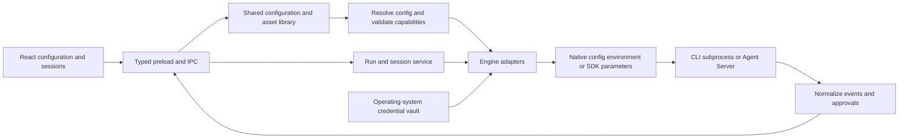

# Initial CLI agent research and configuration architecture

Research date: **2026-09-17**. English edition: **2026-09-18**. Target application: AgentMatrix, built with Electron, React, and TypeScript.

Scope: Claude Code, Codex CLI, OpenCode, Pi, Gemini CLI, OpenHands, Cline, Goose, and DeepSeek Harness. Findings were checked against official documentation, repository READMEs, and relevant configuration source code. **The original research did not install, launch, or call these nine products for compatibility testing.** Subsequent installed-release evidence is recorded separately in the [2026-09-18 probe report](engine-probe-2026-09-18.md). Default-branch capabilities may not be available in released versions; integration must identify the installed version and probe its capabilities. Recommendations describe proposed AgentMatrix behavior, not implemented runtime features.

**Delivery scope updated 2026-09-18:** the first integrations are **OpenCode → Pi → DeepSeek Harness**, following the user's product priorities. The other six remain researched candidates for later delivery. The design and delivery sections below reflect the revised [implementation plan](cli-agent-plan.md); the upstream findings and pinned source baseline are unchanged.

## 1. Main conclusions

**Use a shared configuration library, agent profiles, and an adapter for each engine.** Users maintain prompts, model connections, credentials, MCP servers, Skills, and capability bundles independently. Each agent selects a runtime engine, binds shared assets, and adds engine-specific settings.

All nine product or SDK ecosystems allow customization of system instructions, model endpoints, and authentication. Their entry points, protocols, and scopes differ. They are not nine interchangeable commands with identical `systemPrompt`, `baseUrl`, and `apiKey` arguments.

The initial data model should distinguish five concepts:

1. **Engine versus model service.** Claude Code, Codex, and Pi are engines. Anthropic, OpenAI, an enterprise gateway, and Ollama are model services. One engine can connect to several services, and one service can serve several engines.
2. **Appending instructions versus replacing the system prompt.** Project rules, Skills, initial tasks, and compaction prompts are separate concepts. Prepending everything to the first user message is not an equivalent implementation.
3. **Endpoint versus protocol.** Distinguish at least Anthropic Messages, OpenAI Responses, OpenAI Chat Completions, Gemini, and Vertex. Protocol, authentication, and model tool-calling capabilities must match before a connection can be bound.
4. **Portable assets versus native plugins.** MCP definitions and Skills are comparatively reusable. Executable plugins generally belong to their own ecosystem. Pi requires an extension for MCP; plugin manifests, lifecycles, and permissions are not interchangeable.
5. **Saving configuration versus applying it to a running session.** Some settings load at startup, others on the next request, and resumed sessions may retain earlier prompts. The UI should distinguish saved, awaiting a new session, and applied states.

Two integrations need distinct treatment. The supplied OpenHands main repository now hosts **Agent Canvas**, while its standalone V1 CLI states that it is no longer actively maintained. DeepSeek Harness is explicitly a developer preview with rapid breaking changes. Prefer OpenHands SDK / Agent Server for long-term integration, keeping the legacy CLI as a compatibility option. Treat DeepSeek Harness as experimental and pin its adapter to a version. [OpenHands main repository][oh-main], [CLI status][oh-cli], [DeepSeek Harness][dsh-main]

## 2. Capability comparison

### 2.1 Instructions and model connections

Support means an official entry point exists, not that every model, gateway, or released version is compatible. Section 3 describes the restrictions.

| Engine           | System instruction entry points                                                                                         | Custom endpoint / key entry points                                                            | Differences to preserve                                                                                                              |
| ---------------- | ----------------------------------------------------------------------------------------------------------------------- | --------------------------------------------------------------------------------------------- | ------------------------------------------------------------------------------------------------------------------------------------ |
| Claude Code      | Append with `--append-system-prompt[-file]`; replace with `--system-prompt[-file]`; project instructions in `CLAUDE.md` | `ANTHROPIC_BASE_URL`; `ANTHROPIC_API_KEY` or `ANTHROPIC_AUTH_TOKEN`                           | Gateway must match Anthropic semantics; account login differs from API keys; resumed sessions have prompt snapshot behavior          |
| Codex CLI        | Additional `developer_instructions`; replacement `model_instructions_file`; project rules in `AGENTS.md`                | `model_providers.<id>.base_url / env_key / wire_api`                                          | Current custom wire API reference specifies `responses`; a Chat Completions gateway is not a direct substitute                       |
| OpenCode         | `agent.<name>.prompt`, including `{file:...}`; rules through `instructions` and related entry points                    | `provider.<id>.options.baseURL / apiKey`, paired with a provider SDK package                  | SDK package determines protocol; built-in/custom agents, model routing, and permissions are separate                                 |
| Pi               | `SYSTEM.md` or `--system-prompt`; `APPEND_SYSTEM.md` or `--append-system-prompt`                                        | `models.json`: `providers.<id>.baseUrl / api / apiKey`                                        | Multiple protocols; context and Skills may still be added after replacing the core prompt; interpolation syntax is version-sensitive |
| Gemini CLI       | Full override with `GEMINI_SYSTEM_MD`; project context through `GEMINI.md`                                              | `GOOGLE_GEMINI_BASE_URL` + `GEMINI_API_KEY`; separate Vertex route                            | Endpoint override depends on authentication mode; not a general OpenAI-compatible client                                             |
| OpenHands        | SDK `Agent.system_prompt` or templates; append through `AgentContext.system_message_suffix`                             | SDK `LLM(model, base_url, api_key)`; legacy CLI `agent_settings.json`                         | Legacy CLI environment overrides require `--override-with-envs`; SDK customization is not necessarily a CLI flag                     |
| Cline            | CLI `--system`, rule directories, SDK `systemPrompt`                                                                    | Provider settings including `baseUrl / apiKey / protocol`                                     | Current CLI / SDK schemas differ from older IDE configuration; do not copy obsolete fields                                           |
| Goose            | Override `prompts/system.md`; additional Recipe `instructions` and Hints                                                | Provider-specific settings; OpenAI example: `OPENAI_HOST / OPENAI_BASE_PATH / OPENAI_API_KEY` | Host and request path are separate; API keys in ordinary `config.yaml` are ignored                                                   |
| DeepSeek Harness | `dsh-system-prompt` persona prefix/suffix; plugin section with `complete: true` for a full prompt                       | `llm-pi-ai.providers`: `baseURL / api / apiKeyEnv`; separate native DeepSeek adapter          | Cordis composition determines capabilities; full replacement uses plugin APIs, not an assumed universal `--system-prompt` flag       |

Sources: [Claude CLI][cc-cli] / [environment][cc-env]; [Codex configuration][cx-config]; [OpenCode agents][oc-agents] / [providers][oc-providers]; [Pi CLI][pi-cli] / [models][pi-models]; [Gemini prompt][gm-prompt] / [configuration][gm-config]; [OpenHands Agent][oh-agent] / [LLM][oh-llm]; [Cline CLI][cl-cli] / [provider schema][cl-provider]; [Goose prompts][gs-prompt] / [providers][gs-providers]; [DSH prompts][dsh-prompt] / [providers][dsh-providers].

### 2.2 Extensions and desktop integration interfaces

| Engine           | MCP / Skills                                                    | Native extension mechanisms                          | Suggested desktop entry point                                                                            |
| ---------------- | --------------------------------------------------------------- | ---------------------------------------------------- | -------------------------------------------------------------------------------------------------------- |
| Claude Code      | Native MCP and Skills                                           | Claude plugins, hooks, subagents, and related assets | Agent SDK, or bidirectional `stream-json` with `claude -p`                                               |
| Codex CLI        | Native MCP and Skills                                           | Codex plugins, Skills, and role configuration        | **`codex app-server`** for events, approvals, authentication, and sessions; `exec --json` for batch work |
| OpenCode         | Native MCP and Skills                                           | JS/TS / npm plugins, custom tools and agents         | `opencode acp`, or its server / SDK                                                                      |
| Pi               | **MCP requires an extension**; native Skills                    | TypeScript extensions; npm / git Pi packages         | **`pi --mode rpc`** or TypeScript SDK                                                                    |
| Gemini CLI       | Native MCP and Skills                                           | Gemini extensions, hooks, subagents                  | **`gemini --acp`**; headless JSON for batch work                                                         |
| OpenHands        | MCP in SDK / CLI; AgentSkills in SDK                            | Python tools, Skills, plugins, workspace backends    | SDK / Agent Server; legacy `openhands acp` for compatibility                                             |
| Cline            | Native MCP and Skills                                           | Current CLI / SDK plugins, hooks, workflows          | **`cline --acp`** or `@cline/sdk`; `--json` for structured output                                        |
| Goose            | MCP is a primary extension mechanism; Skills                    | Built-in / MCP extensions, Recipes, custom providers | **`goose acp`**; `goose serve` for a separate service                                                    |
| DeepSeek Harness | Official MCP / Skills plugins, depending on profile composition | Cordis plugin trees, profiles, bundles               | **`dsh --profile sdk`**; ACP only for its supported automation features                                  |

Sources: [Claude CLI][cc-cli]; [Codex App Server][cx-app] / [non-interactive mode][cx-exec] / [Skills][cx-skills]; [OpenCode ACP][oc-acp] / [configuration][oc-config]; [Pi README][pi-cli] / [RPC][pi-rpc]; [Gemini ACP][gm-acp] / [Skills][gm-skills]; [OpenHands CLI][oh-cli] / [SDK][oh-sdk]; [Cline CLI][cl-cli] / [SDK][cl-sdk]; [Goose ACP][gs-acp] / [Skills][gs-skills]; [DSH CLI][dsh-cli] / [ACP limitations][dsh-acp].

**MCP, ACP, and JSON output serve different layers.** MCP connects tools and resources; ACP connects a host UI to an agent; JSON is a serialization format that does not itself guarantee bidirectional approvals, cancellation, or resumption. Exposing an MCP server does not establish that an engine also provides the MCP client behavior AgentMatrix needs.

## 3. Integration details by project

### 3.1 Claude Code

**Configuration and instructions.** Common files include user `~/.claude/settings.json`, project `.claude/settings.json`, and local-project `.claude/settings.local.json`. Managed configuration adds higher-level constraints. `--settings` merges overrides for specified fields; it does not automatically isolate other sources. [Settings][cc-settings]

System-prompt flags distinguish text/file input and append/replace behavior. Prefer append for shared role instructions and preserve `CLAUDE.md` as project conventions. Current documentation also explains that resumed sessions may retain the prompt recorded at the first request until compaction or a new conversation. Newer versions provide `--system-prompt-snapshot off`; changing a file and restarting the CLI does not always update an old session immediately. [CLI reference][cc-cli]

**Model connections.** `ANTHROPIC_BASE_URL` must target a service supporting the required Anthropic request semantics. API keys use `X-Api-Key`; `ANTHROPIC_AUTH_TOKEN` uses Bearer authentication. Model these separately. Bedrock, Google Cloud, and Foundry routes also have distinct authentication rather than one universal key field. [Environment variables][cc-env]

**MCP and execution.** `--mcp-config` supplies run configuration. `--strict-mcp-config` restricts ordinary MCP sources, subject to managed-policy rules. `--input-format stream-json` and `--output-format stream-json` are programmatic entry points; use the installed CLI / SDK version's interaction options. [CLI reference][cc-cli]

**Engine-specific options:** permission mode, allowed/disallowed tools, configuration sources, model aliases, budgets, subagents, hooks, plugins, and prompt snapshot policy. Present approvals separately from sandbox enforcement; prompts do not define execution permissions.

### 3.2 Codex CLI

**Configuration and instructions.** Core configuration is `$CODEX_HOME/config.toml`, usually under `~/.codex/`. The current official sample puts named profiles in `$CODEX_HOME/<name>.config.toml`, unlike the embedded profile format commonly used by older versions. Read and write according to the installed version. `developer_instructions` adds instructions, `model_instructions_file` replaces base instructions, and `compact_prompt` serves a different purpose. [Sample][cx-config], [reference][cx-reference]

**Model connections.** Custom providers use separate IDs with `base_url`, `env_key`, `wire_api`, and any required headers. The current sample specifies `wire_api = "responses"`. The built-in OpenAI endpoint has a separate `openai_base_url` override. A gateway exposing only `/chat/completions` is not native Codex compatibility; streaming events, tool calls, and model requirements also need verification. [Provider configuration][cx-config]

**Desktop integration.** App Server is the official interface for rich integrations, covering authentication, history, approvals, and streamed events. It defaults to stdio. Initialize with `initialize` / `initialized`, then manage threads and turns. Wire details differ from conventional JSON-RPC; use schemas/types generated by that version. `codex exec --json` is better suited to task-oriented batch execution. [App Server][cx-app], [non-interactive mode][cx-exec]

**MCP and Skills.** MCP definitions live under `[mcp_servers.<name>]` and cover local processes, remote HTTP, and authentication options. Skills are directories containing `SKILL.md`; repository and user discovery have explicit rules. Duplicate names do not necessarily follow a simple project-over-user precedence rule. [MCP][cx-mcp], [Skills][cx-skills]

**Engine-specific options:** approvals, filesystem/network permissions, reasoning effort, model capabilities, web search, roles, and multi-agent configuration. Do not unconditionally send the current application's `0.7` temperature default to models that do not accept it.

### 3.3 OpenCode

**Configuration.** Uses `opencode.json` / JSONC, commonly `~/.config/opencode/opencode.json` at user scope. Sources merge in layers. In particular, `OPENCODE_CONFIG` loads after user configuration but before project configuration: **an explicit config file does not guarantee that it overrides project settings**. `OPENCODE_CONFIG_CONTENT` runtime overrides remain subject to managed configuration. [Configuration and precedence][oc-config]

**Instructions and connections.** Custom agent prompts can reference files; agents also define model, temperature, mode, and permissions. Models use `provider/model` routing. Custom providers require the appropriate SDK package: `@ai-sdk/openai-compatible` and `@ai-sdk/openai` do not imply the same request path. Endpoints use `options.baseURL`; keys can reference `{env:VARIABLE}`. [Agents][oc-agents], [providers][oc-providers]

**MCP.** The key is `mcp`. Local entries combine the executable and arguments into a `command` array and use `environment` for variables. Remote entries use `url`, `headers`, `oauth`, and related fields. The adapter must convert AgentMatrix's separate string command and argument array. [MCP][oc-mcp]

**Engine-specific options:** primary/subagent role, per-tool permission rules, provider npm packages, model metadata, small model, plugins, and organization sources. Start with ACP; adopt the native server / SDK when richer events are needed. [ACP][oc-acp], [configuration][oc-config]

### 3.4 Pi

**Project identity.** This research uses the supplied `earendil-works/pi` repository. Its coding-agent package is `@earendil-works/pi-coding-agent`; do not infer current behavior from historical repository or package names. [Repository][pi-main]

**Configuration and instructions.** Global configuration usually lives in `~/.pi/agent/`, overridable with `PI_CODING_AGENT_DIR`, and includes settings, model definitions, and authentication files. Project configuration lives in `.pi/`. `SYSTEM.md` replaces and `APPEND_SYSTEM.md` appends; CLI flags provide corresponding entry points. Context files and Skills may still be added when `--system-prompt` replaces the default prompt. [CLI][pi-cli], [environment][pi-env]

**Model connections.** `models.json` provides `baseUrl`, `api`, and `apiKey`. Supported API families include OpenAI, Anthropic, and Google, but each route must select the correct API type. Current documentation uses `$MY_API_KEY` interpolation and also permits command-based secret resolution. Prefer credential references; importing configuration must not automatically execute `!command`. Keyless local services may need a Pi placeholder key, handled as a nonsecret compatibility value by the adapter. [Models][pi-models]

**Two material limitations.** Pi explicitly lacks built-in MCP and general-purpose tool permission popups. Extensions can add MCP or approval flows. Project trust controls loading project resources; it is not a filesystem or network sandbox. [CLI extension/design notes][pi-cli], [repository security boundary][pi-main]

**Engine-specific options:** extensions, Pi packages, tool sets, project trust, thinking level, and compaction. Prefer RPC or SDK. RPC uses strict LF-delimited JSONL; do not split on other Unicode line separators. [RPC][pi-rpc]

### 3.5 Gemini CLI

**Configuration and instructions.** Common files are `~/.gemini/settings.json` and project `.gemini/settings.json`. `GEMINI_CLI_HOME` is a user-data root under which the CLI creates `.gemini`; it is not directly the settings directory. [Configuration][gm-config]

`GEMINI_SYSTEM_MD=/absolute/path/system.md` fully replaces core instructions; `true` / `1` selects project `.gemini/system.md`. `GEMINI.md` carries project and role context. Override templates support variables for tools, Skills, and related content; avoid unconditionally removing required variables. [System prompt][gm-prompt]

**Model connections.** API-key authentication uses `GEMINI_API_KEY` and `GOOGLE_GEMINI_BASE_URL`. Vertex uses `GOOGLE_VERTEX_BASE_URL` with separate authentication, project, and location settings. OAuth login is another route. Custom endpoints do not establish OpenAI Chat Completions support. [Configuration][gm-config]

**Extensions and execution.** Native MCP, Agent Skills, and ACP are available. Prefer `gemini --acp` for the desktop, with headless mode for one-shot automation. Map MCP stdio/SSE/HTTP fields according to the current schema; renaming a transport is not a protocol conversion. [MCP][gm-mcp], [Skills][gm-skills], [ACP][gm-acp], [headless mode][gm-headless]

**Engine-specific options:** authentication route, cloud project/region, approval mode, sandbox, policy, extensions, context discovery, and available subagents.

### 3.6 OpenHands

**Separate product layers.** `OpenHands/OpenHands` now primarily hosts Agent Canvas. Agent capabilities reside in software-agent-sdk, Agent Server, and related components. The standalone `OpenHands-CLI` README says it is no longer actively maintained. A single undifferentiated `openhands` engine ID cannot describe version and execution mode adequately. [Main repository][oh-main], [CLI][oh-cli]

Use `openhands-sdk` for the long-term integration and `openhands-cli-legacy` for compatibility; the UI can group both under the OpenHands brand.

**System prompt and model connection.** The current SDK `Agent` accepts inline `system_prompt` or templates through `system_prompt_filename` and `system_prompt_kwargs`. `AgentContext.system_message_suffix` appends instructions. `LLM` provides `model`, `base_url`, and `api_key`. These are verified SDK fields, not a claim that every old CLI exposes equivalent flags. [Agent][oh-agent], [AgentContext][oh-context], [LLM][oh-llm]

**Legacy CLI.** Uses `~/.openhands/agent_settings.json`, `cli_config.json`, and `mcp.json`. `LLM_API_KEY`, `LLM_MODEL`, and `LLM_BASE_URL` are ignored unless `--override-with-envs` is passed; those overrides are not persisted. `--headless -f file` reads task input, not a system prompt. ACP and headless JSON provide transitional integration options. [CLI][oh-cli]

**Extensions and specific settings.** The SDK has MCP tools, AgentSkills, plugin, and marketplace examples. Keep tools, workspace backends, Agent Server, condenser, critic, and confirmation policy as engine-specific settings. Container and remote execution also require resource-path translation. [SDK][oh-sdk], [Skills example][oh-skills], [plugin example][oh-plugins]

### 3.7 Cline

**Project identity.** The current repository includes `apps/cli` and `@cline/sdk`; Cline is not only a VS Code extension. CLI options include `--system`, `--provider`, `--model`, `--acp`, and structured output through `--json`. [CLI][cl-cli], [CLI README][cl-readme]

**Configuration.** Current documentation puts provider, global, and MCP settings under `~/.cline/data/settings/`, with project resources under `.cline/`. `--config` selects a configuration directory, while `--data-dir` isolates local state; these are different operations. Rules, Skills, hooks, and plugins also have their own global/project search paths. [Configuration][cl-config]

**Model connections.** Current `ProviderSettings` includes `provider`, `model`, `protocol`, `baseUrl`, `apiKey`, `auth`, and `headers`. Protocol values include `openai-chat`, `openai-responses`, `anthropic`, and `gemini`. The persisted `providers.json` has a version and provider-entry/settings wrapper; a bare ProviderSettings object is not the whole file. Prefer SDK/configuration services. Do not rely on an unverified general `--base-url` flag or obsolete flat IDE settings. [Provider schema][cl-provider], [storage schema][cl-storage]

**Approval difference.** The current CLI reference says ordinary `--auto-approve` defaults to enabled, while ACP defaults to disabled. AgentMatrix must apply the selected policy explicitly rather than assuming every CLI asks first. [CLI][cl-cli]

**Engine-specific options:** Plan/Act, thinking, retries, automatic approval, command permissions, hooks, workflows, plugins, and hub/session backend. Skill discovery and duplicate-name precedence also require Cline-specific handling. [Skills][cl-skills]

### 3.8 Goose

**Configuration and instructions.** On macOS/Linux, configuration commonly lives in `~/.config/goose/config.yaml`. The current provider structure uses `active_provider` and `providers`; older flat keys are compatibility input. `GOOSE_PROVIDER` / `GOOSE_MODEL` remain environment overrides. `GOOSE_PATH_ROOT` isolates configuration, data, and state roots. [Configuration][gs-config], [environment][gs-env]

Customize `prompts/system.md` to override the system template. Templates use Jinja-style variables, including tool/extension context that may need to be preserved. Recipe `instructions` and `prompt` describe runtime instructions and task input respectively; they should not both be classified as system prompts. Template changes generally apply to new sessions. [Prompt templates][gs-prompt], [Recipes][gs-recipes]

**Model connections.** For an OpenAI-compatible route, `OPENAI_HOST` is the service root and `OPENAI_BASE_PATH` is the appended path, usually `v1/chat/completions`. The key comes from the environment or secret storage; ordinary `config.yaml` keys are ignored. Other providers have their own options. [Providers][gs-providers]

**MCP, Skills, and execution.** MCP extensions currently support stdio and Streamable HTTP; the configuration reference explicitly excludes legacy SSE. Skills prefer `.agents/skills` locations. Start `goose acp` for desktop integration; `goose serve` supports remote connections with the required authentication. [Configuration][gs-config], [Skills][gs-skills], [ACP][gs-acp]

**Engine-specific options:** Recipes, extension types, tool filters, `GOOSE_MODE`, compaction, and provider/model metadata. Goose can also wrap another CLI as an ACP provider. Show that execution chain separately so users can distinguish nested agents from an ordinary model API change. [Providers][gs-providers]

### 3.9 DeepSeek Harness

**Project identity.** This is a Cordis-based agent harness with the `dsh` command, not simply a DeepSeek endpoint preset for another CLI. The official repository labels it developer preview. Findings here are tied to the source snapshots below. [Repository][dsh-main]

**Configuration.** `$DSH_HOME` defaults to `~/.dsh`. Mutable model settings use `settings.yaml`; credentials use a separate `.credentials.yaml`. Profiles under `profiles/<name>` combine plugins through `package.json`'s `dsh.profile` and `cordis.patch.yml`. Profile patches, home patches, and `--patch` overlays have their own precedence. Automatic patch reloading applies only to profiles configured for live reload. [Providers][dsh-providers], [CLI][dsh-cli]

**System prompt.** `dsh-system-prompt` provides `personaPrefix`, `personaSuffix`, runtime context, and tool ordering. Plugins register scoped sections. One effective `complete: true` section provides a complete replacement; multiple complete sections fail. Shared appended instructions and complete replacement therefore need different adapter paths. [System prompt][dsh-prompt]

**Model connections.** General custom providers use `baseURL`, `api`, and `apiKeyEnv`; the current UI lists `openai-completions`, `openai-responses`, and `anthropic-messages`. The native DeepSeek adapter has a separate `deepseek-official` route, protocol, and reasoning controls. Do not collapse both routes into one schema. The general provider settings UI does not yet support OAuth providers. [Providers][dsh-providers], [native adapter][dsh-llm]

**Runtime limitations.** `dsh --profile sdk` exposes SDK JSON-RPC; `--profile headless` runs a single task; `--profile acp` supports automation. Its ACP reference explicitly omits full DSH cards, plans, terminal interaction, elicitation, and other presentation features. Resume support does not imply historical-event replay. Evaluate the SDK route for a complete desktop experience. [CLI][dsh-cli], [ACP][dsh-acp]

**Installed-release follow-up (2026-09-18):** DSH 0.1.5-rc.2 SDK handshakes successfully but rejects `session/cancel` and `session/resume`; its published request map contains only initialization, prompt submission, and shutdown. The initial AgentMatrix adapter therefore selects ACP and documents its reduced presentation/history surface. The initial checks made no model calls. A subsequent [ACP lifecycle fixture](dsh-acp.md) verifies two local provider routes, tools, approvals, cancellation, and native restoration. The installed native DeepSeek component uses Chat Completions; repository documentation describing different protocol defaults is not an installed-release contract. See the [probe evidence](engine-probe-2026-09-18.md).

**Engine-specific options:** profiles, bundles, patches, Cordis parameters, permission presets, sandbox backends, persona, tool presentation, and provider reasoning. MCP and Skills are official components, but minimal profiles may omit them; inspect effective capabilities. [MCP][dsh-mcp], [Skills][dsh-skills], [configuration catalog][dsh-catalog]

## 4. Shared maintenance versus engine-specific configuration

| Asset             | Maintain centrally                                                                   | Preserve per engine                                                             | Behavior when unsupported                                                         |
| ----------------- | ------------------------------------------------------------------------------------ | ------------------------------------------------------------------------------- | --------------------------------------------------------------------------------- |
| Model connection  | Name, URL, protocol, credential references, nonsecret headers                        | Provider ID, SDK package, cloud region, routing options, path assembly          | Reject incompatible bindings and identify the missing protocol or feature         |
| Model profile     | Model ID, connection, confirmed capabilities and limits                              | Reasoning enums, aliases, caching, provider-specific parameters                 | Omit unsupported parameters; never silently change the model                      |
| Prompt            | Markdown content, version, purpose, scope                                            | Append/replace entry points, variables, native instruction levels               | Explain missing mappings; never silently turn instructions into a task message    |
| Project rules     | Reusable project conventions and applicable directories                              | `CLAUDE.md`, `AGENTS.md`, `GEMINI.md`, and their hierarchy                      | Preview generated changes and preserve existing user files                        |
| MCP server        | Command/args, cwd, environment references, URL, headers, auth, timeouts              | Native keys, OAuth, filtering, transport support                                | Mark Pi as extension-required; never rename SSE to HTTP without a bridge          |
| Skill             | Complete directory, `SKILL.md`, frontmatter, scripts/references, version, provenance | Search paths, extra metadata, activation, name conflicts                        | Explain degradation; plain-text export is not native Skill support                |
| Capability bundle | References to prompts, MCP servers, and Skills                                       | Optional dependencies on native plugins per engine                              | Show portable resources separately from unavailable native plugins                |
| Execution policy  | Cwd, environment, timeout, concurrency, requested approval policy                    | Sandbox implementation, file/network rules, command filters, automatic approval | Block startup or require a different configuration when constraints cannot be met |
| Session           | Title, engine ID, native session ID, status, unified event index                     | Native transcripts, resume/fork/compact semantics                               | Label summary-seeded new sessions honestly; do not claim native migration         |

**Unify user intent and asset content, not native file formats.** One code-review instruction asset could become a Claude appended prompt, Codex developer instructions, or an OpenHands context suffix. Its text is reusable, but instruction precedence and surrounding runtime context are not guaranteed to be equivalent.

## 5. Recommended data model

### 5.1 Core entities

| Entity                     | Key fields and responsibilities                                                                                                                                         |
| -------------------------- | ----------------------------------------------------------------------------------------------------------------------------------------------------------------------- |
| `EngineInstallation`       | Engine kind, absolute executable path, version, launch-prefix args, platform, supported interfaces, probe timestamp                                                     |
| `ModelConnection`          | Protocol, base URL, authentication strategy, credential reference, ordinary/secret headers, cloud options; exactly one protocol per connection                          |
| `ModelProfile`             | Connection ID, model ID, optional sampling/reasoning, context/modality capabilities, and evidence provenance                                                            |
| `Credential`               | Display name, type, operating-system vault reference; renderer receives configured status and redacted metadata only                                                    |
| `PromptAsset`              | Content or file asset, purpose such as role instructions / project rules / system template / compaction template, and revision                                          |
| `McpServerDefinition`      | Discriminated stdio / Streamable HTTP / legacy SSE structures, authentication strategies, tool filters                                                                  |
| `SkillAsset`               | Directory asset and digest, frontmatter, provenance, version, supporting files, engine compatibility, transformation limits                                             |
| `CapabilityBundle`         | Shared resource-ID collection, corresponding to the application's current resource-bundle plugin concept                                                                |
| `NativePluginInstallation` | Engine-specific plugin ID, source, version, installation path, and configuration; separate from bundles                                                                 |
| `AgentProfile`             | Name, engine installation, model profile, prompt/MCP/Skill/bundle bindings, engine-specific options, and draft validation state                                         |
| `Session` / `Turn`         | Conversation identity, native session mapping, turn/request IDs, lifecycle state, event cursor, and supported recovery behavior                                         |
| `RunSnapshot`              | Immutable prelaunch asset versions, engine/adapter version, policy and configuration digests; subsequent observations are recorded separately; no plaintext credentials |

Authentication strategies should distinguish at least `api-key`, `bearer`, `engine-login`, `cloud-identity`, and `none`. Let native engines maintain renewable subscription/OAuth credentials where possible; do not copy account tokens into a shared API-key field. Multiple connections may reference a credential, but each connection explicitly determines the destination host and authentication header.

Make `temperature`, `topP`, and reasoning settings optional. Supported ranges and combinations differ by engine and model; a required global value must not be sent unconditionally.

Persistable drafts can lack an engine, protocol, credential, or prompt binding mode, particularly after migration. Launchable inputs require resolved references and compatible capabilities. One confirmed protocol per connection is a launch invariant, not a reason to reject an incomplete imported draft. Sessions, process attachments/runs, turns, and native interaction requests have distinct identities; restarting a process is not creating a new conversation by definition.

### 5.2 Example agent profile

This is an **AgentMatrix design proposal**, not a native CLI file or the current application schema:

```json
{
  "id": "reviewer-codex",
  "name": "Code review assistant",
  "engineInstallationId": "codex-local",
  "modelProfileId": "company-review-model",
  "promptBindings": [
    {
      "assetId": "review-instructions",
      "mode": "append",
      "follow": "latest"
    }
  ],
  "mcpBindings": [{ "serverId": "team-docs", "enabled": true }],
  "skillBindings": [{ "skillId": "review-checklist", "version": "1.0.0" }],
  "bundleIds": [],
  "nativePluginIds": [],
  "launch": {
    "cwd": "/path/to/project",
    "configMode": "managed-profile"
  },
  "engineOptions": {
    "codex": {
      "approvalPolicy": "on-request"
    }
  }
}
```

A Claude or Gemini profile can bind the same `review-instructions`. Profiles following the latest revision use updates on new runs; pinned profiles retain their selected revision. Every run records the final digest so users can identify the actual instructions used.

Here, `append` describes a common **behavioral intent**. The adapter records `nativePromptTarget`, instruction level, and application timing. For example, the UI must not claim Gemini project context has precisely the same underlying semantics as a Claude append flag.

### 5.3 Queryable capability descriptors

Calculate capabilities from engine, installed version, mode, and effective profile. Include:

- **Prompts:** append/replace/project-rule entry points, instruction level, template syntax, and application timing.
- **Models:** protocols, authentication routes, endpoint overrides, and supported parameters.
- **MCP:** native/extension/unsupported, transport, OAuth, tool filtering, and live-update support.
- **Skills/plugins:** discovery paths, loading mode, extension fields, and whether code executes.
- **Runtime:** ACP/RPC/SDK, approvals, cancellation, resumption, session listing, forks, and event replay.
- **Isolation:** process/container/remote execution, filesystem/network boundaries, and restrictions on tool child processes.

Represent three independent dimensions: support mechanism (`native / adapter / extension-required / unsupported / unknown`), verification (`untested / passed / failed`), and current availability with reasons. For example, a documented native feature can still be untested or blocked by missing credentials. Attach source evidence, engine version, mode, profile, and relevant model route; re-evaluate after changes. Documentary support becomes verified availability only after testing the installed version.

## 6. Electron integration architecture



Preserve the existing main-process/preload boundary. The main process or a utility process manages secrets, files, and subprocesses. The renderer does not receive arbitrary shell or filesystem write access.

Each adapter owns these stages:

| Stage                       | Output                                                                                                               |
| --------------------------- | -------------------------------------------------------------------------------------------------------------------- |
| `probe`                     | Installation path, version, modes, and actual capabilities                                                           |
| `inspect`                   | Read existing configuration with redaction and source information; no implicit changes                               |
| `validate`                  | Diagnostics for protocol mismatches, missing assets, unknown fields, and unmet permissions                           |
| `plan`                      | Managed files to write, native field mappings, launch preview, and overridden values                                 |
| `materialize`               | Capture asset revisions and atomically publish immutable per-run config, prompts, Skills, and manifest before launch |
| `launch`                    | Spawn with an argument array and run-specific environment, or establish SDK/service connectivity                     |
| `send / respond`            | Submit additional turns and respond to the exact native approval or interaction request, subject to capabilities     |
| `observe`                   | Normalize message deltas, tools, approvals, failures, usage, and completion while retaining native event types       |
| `cancel / resume / dispose` | Use native protocols, release processes and temporary resources, and handle abnormal exits                           |

Keep raw events or references to versioned raw logs. Missing cost, token, or tool-status data remains unknown, not zero. Approval responses resolve only the matching native request. A batch mode without reliable bidirectional approvals must not masquerade as a fully interactive session.

The preload contract needs both commands and subscriptions: start, send, respond, cancel, resume, close, query state, and subscribe/unsubscribe with an event cursor. The session UI must survive renderer reload without resubmitting a turn or duplicating replayed messages. Redact native evidence before exposing or persisting it. A shared ACP client must handle agent-to-client requests and advertise only implemented file/terminal services, not merely normalize notifications.

Reuse ACP client infrastructure where applicable, but keep engine-specific configuration and capability adapters. Use Codex App Server, Pi RPC, OpenHands SDK/Agent Server, and DSH SDK or limited ACP according to required behavior. PTY is a fallback for native terminal experiences; ANSI parsing should not be the primary source for tool and approval state.

## 7. Dynamic maintenance and configuration distribution

### 7.1 Three configuration views

- **Shared assets:** original prompt, model connection, MCP, and Skill content with versions.
- **Agent bindings:** referenced assets, parameter overrides, and engine-specific options.
- **Effective configuration:** resolved inputs plus separately recorded observations of loaded assets, native sources, conflicts, and applied versions. A generated file is not proof of loading; unavailable readback remains unknown.

Suggested layout: a shared resource library, an agent list, and tabs for general configuration, engine-specific configuration, effective preview, and diagnostics. Versioned schemas drive specialized fields; an advanced JSON editor should not be the only interface.

### 7.2 Two management modes

**Managed profiles.** Keep editable definitions per engine/profile, then capture immutable configuration and asset inputs separately for each run before launch. Prefer official config-home, config-file, or SDK entry points. Do not change system `HOME` to simulate isolation: that affects authentication, Git, SSH, package managers, and tools. A custom config directory also does not guarantee that project or managed sources stop loading; the adapter must report actual sources, precedence, conflicts, and evidence of application.

**Existing configuration management.** The initial milestone imports read-only, preserving unknown fields and provenance; native-file write-back and two-way synchronization are deferred. Future editing should show a diff, create a backup, and use structured writes supported by the native format. Detect external changes with hashes/revisions rather than blindly synchronizing both ways. Project rule files belong to users; generate separate fragments or reference them through native entry points by default.

Suggested managed paths are `userData/engines/<installationId>/profiles/<profileId>/` for profile definitions and `userData/runs/<runId>/` for captured inputs and manifests. Keep writable native session state separate. Two runs must not share mutable generated configuration. Retain captured revisions needed by resumable sessions; do not silently regenerate their inputs from the latest library version. External native sources remain separately tracked and may prevent complete reproducibility. These are internal AgentMatrix conventions that adapters map to native paths.

### 7.3 When changes take effect

| Change                                     | AgentMatrix default behavior                                                                                               |
| ------------------------------------------ | -------------------------------------------------------------------------------------------------------------------------- |
| Shared prompt or Skill edit                | Save a revision and show affected agents; apply to new runs and handle old sessions according to native capabilities       |
| Endpoint or model edit                     | Validate protocol/model/auth compatibility; use the connection for new runs or explicitly apply a supported session switch |
| Key rotation                               | Update referenced credential content; refresh or restart depending on engine authentication caching                        |
| MCP addition, removal, or parameter change | Apply to new sessions by default; reconnect live only if natively supported, and report failures                           |
| Native plugin upgrade                      | Pin source/version and check schema/dependencies; do not treat executable updates as ordinary Markdown edits               |
| External native-config edit                | Reload and present conflicts; let the user import changes or retain the managed version                                    |

Do not restart a CLI mid-task merely to provide immediate configuration updates. Queue execution-affecting changes for the next turn or session unless the engine provides an explicit update protocol. Claude prompt snapshots, Goose new-session templates, and DSH request/profile reload behavior demonstrate these differences. [Claude CLI][cc-cli], [Goose templates][gs-prompt], [DSH providers][dsh-providers] / [CLI][dsh-cli]

The initial implementation defaults to new-session application. Show saved, pending-new-session, applied, and failed/unknown states with affected profiles. Supported live changes require explicit application and acknowledgment. Resume checks the prior snapshot and native state, engine version, secret availability, and external-source drift; it must not silently claim new prompt content was applied to an old conversation.

### 7.4 Credentials and execution boundaries

Store credentials in the operating-system vault; ordinary workspace JSON contains references only. The editor can accept replacement keys but returns redacted status after saving. Redact logs, command previews, and exports. Prefer process environment or SDK authentication rather than putting plaintext keys into command arguments or shell strings. If native files are unavoidable, the adapter must define restrictive file permissions and cleanup.

Inject only the environment required by a run, rather than sharing every provider key with every agent. If a CLI passes its environment to shell tools, moving secrets from the main process to a child process does not itself isolate keys from those tools. A controlled gateway or native isolation mechanism is needed when that stronger boundary is required.

Present tool authorization, human approval, and enforced file/network sandbox boundaries separately. Custom prompts cannot replace these controls. Pi project trust and other engines' Plan modes do not universally mean an operating-system read-only sandbox.

## 8. Implications for the initialized AgentMatrix project

The original research introduced design documentation only; implementation progress is tracked in the [status record](implementation-status.md), and the runtime architecture below remains the target design. The UI has since gained English/Chinese support, which does not implement CLI runtime integration. See [Architecture](architecture.md) and the [README](../README.md) for current behavior.

| Existing structure                                                    | Limitation                                                           | Recommendation                                                                   |
| --------------------------------------------------------------------- | -------------------------------------------------------------------- | -------------------------------------------------------------------------------- |
| `Agent.provider` has three model-provider values                      | Does not represent CLI engines or multiple connection instances      | Separate engine installations and model connections; reference both from agents  |
| Agent owns `model / baseUrl / temperature`                            | Duplicated maintenance and unconditional temperature                 | Extract `ModelProfile`; optional parameters validated against capabilities       |
| `systemPrompt: string`                                                | No shared reference, revision, or append/replace/rule semantics      | Introduce PromptAsset/PromptBinding with migration of existing text              |
| MCP supports two transports and one HTTP bearer environment reference | Missing OAuth, headers, cwd, timeouts, and compatibility diagnostics | Extend discriminated unions; mark legacy SSE separately and add fields as needed |
| Skill instruction text and `sourcePath` only                          | No directory reading or supporting scripts/references                | Add directory assets while preserving plain Markdown as a lightweight form       |
| Plugin is an MCP/Skill resource bundle                                | Ambiguous with executable native plugins                             | Rename to CapabilityBundle and add NativePluginInstallation                      |
| No CLI runtime                                                        | Cannot execute, cancel, resume, or process approvals                 | Add engine adapters and a session service using native agent loops               |
| Environment-name references only                                      | No central model credential vault                                    | Add a main-process credential service                                            |

Suggested module boundaries:

```text
src/shared/engines/           Engines, connections, bindings, capabilities, events
src/main/credentials/        Credential storage and redaction
src/main/assets/             Prompt/Skill directories, versions, import/export
src/main/engines/adapters/   Native configuration and runtime integrations
src/main/engines/config/     Plans, distribution, diffs, conflict detection
src/main/sessions/           Sessions, approvals, cancellation, logs, snapshots
```

Bump `schemaVersion` for the proposed persisted-model migration and preserve a backup. Existing system-prompt text can become an asset, but old data does not specify an engine or append/replace intent. Mark the binding as awaiting engine/mode selection instead of assigning the general assistant to a CLI automatically. Convert old provider/baseUrl/model fields into connections and profiles awaiting protocol confirmation. Preserve resource-bundle references.

This revises the initial scaffolding roadmap: for a multi-CLI product, build **CLI engine adapter → session service → UI** first. If AgentMatrix later implements its own agent, add a separate direct-model provider loop rather than wrapping third-party CLIs in a duplicate agent loop. The more detailed sequencing is in the [implementation plan](cli-agent-plan.md).

## 9. Delivery phases and acceptance

### 9.1 Suggested order

| Phase                     | Scope                                                                                                     | Deliverable                                                                                                                                              |
| ------------------------- | --------------------------------------------------------------------------------------------------------- | -------------------------------------------------------------------------------------------------------------------------------------------------------- |
| 0: verification           | Probe OpenCode, Pi, and DSH installations and selected provider routes; test Pi RPC and DSH SDK early     | Versioned evidence and explicit capability limitations before shared interfaces are finalized                                                            |
| A: shared configuration   | Draft/launchable schemas, assets, credentials, migration, three-engine forms, and session commands/events | Preserve old data, inspect compatibility, and prepare immutable run inputs; other engines are planned catalog entries                                    |
| B: first complete runtime | OpenCode through ACP                                                                                      | Complete the desktop workflow, permissions, cancellation, persistence, and effective-config reporting; review abstractions against Pi/DSH probes         |
| C: second engine          | Pi RPC                                                                                                    | Reuse the application/session contracts with a separate transport; treat MCP and universal approval enforcement as unavailable without validated support |
| D: third engine           | Version-pinned DeepSeek Harness ACP, selected after the installed SDK probe                               | Verify profile composition, prompt/provider mappings, interactions, and native persistence; complete the three-engine milestone                          |
| E: later integrations     | Claude Code, Codex, Gemini CLI, Cline, Goose, and OpenHands                                               | Probe each installed version and implement separate adapters; investigate OpenHands runtime dependencies when scheduled                                  |

This sequence follows the user's selected initial products and is not a ranking of model quality. OpenCode, Pi, and DSH require distinct configuration/runtime adapters even where ACP transport is shared; common provider code does not imply a shared session protocol. The first abstraction gate includes minimal Pi and DSH probes, and each engine has its own acceptance gate. Existing native configuration is initially imported read-only; native plugins are recognized/bound as installed assets, with a pinned DSH composition. General plugin installation and automatic upgrades are deferred.

The implementation plan defines the [shared-versus-engine-specific configuration boundary](cli-agent-plan.md#11-shared-configuration-and-per-engine-settings) and [incremental delivery outcomes](cli-agent-plan.md#21-incremental-delivery). Each engine ships a complete desktop workflow at its own gate; Skill capture, applicable MCP mappings, and bilingual configuration/session controls are part of that gate. The nine-engine comparison remains a research reference, not a requirement to build nine sets of forms for the first release.

### 9.2 Acceptance checklist for every adapter

1. Detect the actual installed version and diagnose missing executables, unknown versions, and old schemas.
2. Bind one shared prompt to two engines and verify their native fields, including append/replace/project-rule distinctions.
3. Validate endpoint, authentication header, and protocol. Reject or explicitly diagnose a Chat Completions-only gateway on a Responses route.
4. Pass stdio MCP arguments without shell reinterpretation; verify HTTP/OAuth behavior and unsupported transports. Pi without its extension must not appear connected.
5. Preserve Skill directories and referenced files; verify discovery, enable/disable, naming conflicts, and lazy loading. Bind native plugins only to matching engines and verified versions; arbitrary installation is outside the initial milestone.
6. Keep keys out of ordinary logs and exports, and prevent environment/resource/configuration leakage between runs.
7. Handle text streams, tool events, rejected approvals, cancellation, crashes, and resumption without relying on native automatic-approval defaults.
8. Show asset versions correctly for old and new sessions after updates. Preserve existing user configuration and project rules.
9. Test mappings and lifecycle with fixed fixtures/fake CLIs, then smoke-test explicit installed versions. Record service, model, and date separately for checks that make real model calls.
10. Preserve legacy resource/bundle references during migration; allow incomplete drafts to save but block launch until requirements are resolved.
11. Capture inputs before spawn; test two runs from one profile and asset edits during execution. Distinguish planned values from observed native values and diagnose source conflicts.
12. Verify bilingual session controls, renderer reconnection, exact interaction correlation, and cancellation races. Unsupported native controls must be labeled unavailable rather than simulated.

### 9.3 Unresolved items before implementation

- Installed-release differences from default-branch documentation, initially OpenCode configuration precedence, Pi RPC/trust behavior, and DSH profile evolution. Codex profiles and Cline schemas remain later integration checks.
- Actual gateway compatibility with Responses/Messages streaming, tools, images, and model IDs. Successful model listing is insufficient.
- Selection and validation of a Pi MCP extension, including its protocol coverage, permissions, and maintenance. No third-party extension is treated as a verified dependency here.
- Complete OpenHands SDK/Agent Server coverage of required events, approvals, and workspace lifecycles is deferred with its integration. Keep the old CLI in a compatibility role.
- The initial DSH SDK probe found no native cancel/resume methods in 0.1.5-rc.2, so the implementation targets ACP with explicit limits; complete lifecycle verification remains required. A generic ACP client cannot invent presentation features absent from the server; resume must not be confused with history replay.
- Separate Windows/macOS/Linux verification of paths, process-tree termination, credential storage, sandboxes, and native plugin dependencies.

## 10. Sources and version records

The research prioritizes official configuration references and current source code. The entry points are the nine projects supplied for the investigation. Claude and Codex use online official documentation; GitHub projects use the pinned commits below. **A default branch or commit is not a promise of stable-release support.** Links throughout the document point to the specific evidence for each claim. The English edition preserves the original research baseline rather than claiming a new compatibility investigation.

| Official source                                                                                                      | Research baseline                                                                                                          |
| -------------------------------------------------------------------------------------------------------------------- | -------------------------------------------------------------------------------------------------------------------------- |
| [Claude Code Quickstart](https://code.claude.com/docs/zh-CN/quickstart) and official CLI/configuration documentation | Online documentation, accessed 2026-09-17                                                                                  |
| [Codex CLI](https://learn.chatgpt.com/docs/codex/cli) and official configuration/App Server documentation            | Online documentation, accessed 2026-09-17                                                                                  |
| [anomalyco/opencode](https://github.com/anomalyco/opencode)                                                          | `dev` / [`88c6c7abc7f3`](https://github.com/anomalyco/opencode/tree/88c6c7abc7f320b6aabed2634ac0b2d6e6ecea67)              |
| [earendil-works/pi](https://github.com/earendil-works/pi)                                                            | `main` / [`509ee2bd0ba9`](https://github.com/earendil-works/pi/tree/509ee2bd0ba9fc3d31fb96fe8f5a6ef73b51833c)              |
| [google-gemini/gemini-cli](https://github.com/google-gemini/gemini-cli)                                              | `main` / [`6a466a7e2fe2`](https://github.com/google-gemini/gemini-cli/tree/6a466a7e2fe2b1255752c1e74f69b31f0216084d)       |
| [OpenHands/OpenHands](https://github.com/OpenHands/OpenHands)                                                        | `main` / [`f2b0aacda17f`](https://github.com/OpenHands/OpenHands/tree/f2b0aacda17fc60ea2ea45cfdd2323c12b034b7d)            |
| [OpenHands/OpenHands-CLI](https://github.com/OpenHands/OpenHands-CLI)                                                | `main` / [`954f2ba646e8`](https://github.com/OpenHands/OpenHands-CLI/tree/954f2ba646e8d749261a8f2b2b7e3031fa39be9f)        |
| [OpenHands/software-agent-sdk](https://github.com/OpenHands/software-agent-sdk)                                      | `main` / [`3103fff8d33d`](https://github.com/OpenHands/software-agent-sdk/tree/3103fff8d33d9d52abd4eea18ff9a50d31de0468)   |
| [cline/cline](https://github.com/cline/cline)                                                                        | `main` / [`d6d456645128`](https://github.com/cline/cline/tree/d6d45664512852a56e59d3e8538c72a3adc94ae1)                    |
| [aaif-goose/goose](https://github.com/aaif-goose/goose)                                                              | `main` / [`db9f67c06307`](https://github.com/aaif-goose/goose/tree/db9f67c063075f7efb52ac80723a23dc70964c94)               |
| [deepseek-ai/deepseek-harness](https://github.com/deepseek-ai/deepseek-harness)                                      | `master` / [`0d1f50007f9b`](https://github.com/deepseek-ai/deepseek-harness/tree/0d1f50007f9bca3f52b06e1c3074fa14d5fb0720) |

[cc-cli]: https://code.claude.com/docs/en/cli-reference
[cc-env]: https://code.claude.com/docs/en/env-vars
[cc-settings]: https://code.claude.com/docs/en/settings
[cx-config]: https://learn.chatgpt.com/docs/config-file/config-sample
[cx-reference]: https://learn.chatgpt.com/docs/config-file/config-reference
[cx-app]: https://learn.chatgpt.com/docs/app-server
[cx-exec]: https://learn.chatgpt.com/docs/non-interactive-mode
[cx-mcp]: https://learn.chatgpt.com/docs/extend/mcp
[cx-skills]: https://learn.chatgpt.com/docs/build-skills
[oc-config]: https://github.com/anomalyco/opencode/blob/88c6c7abc7f320b6aabed2634ac0b2d6e6ecea67/packages/web/src/content/docs/config.mdx
[oc-agents]: https://github.com/anomalyco/opencode/blob/88c6c7abc7f320b6aabed2634ac0b2d6e6ecea67/packages/web/src/content/docs/agents.mdx
[oc-providers]: https://github.com/anomalyco/opencode/blob/88c6c7abc7f320b6aabed2634ac0b2d6e6ecea67/packages/web/src/content/docs/providers.mdx
[oc-mcp]: https://github.com/anomalyco/opencode/blob/88c6c7abc7f320b6aabed2634ac0b2d6e6ecea67/packages/web/src/content/docs/mcp-servers.mdx
[oc-acp]: https://github.com/anomalyco/opencode/blob/88c6c7abc7f320b6aabed2634ac0b2d6e6ecea67/packages/web/src/content/docs/acp.mdx
[pi-main]: https://github.com/earendil-works/pi/blob/509ee2bd0ba9fc3d31fb96fe8f5a6ef73b51833c/README.md
[pi-cli]: https://github.com/earendil-works/pi/blob/509ee2bd0ba9fc3d31fb96fe8f5a6ef73b51833c/packages/coding-agent/README.md
[pi-env]: https://github.com/earendil-works/pi/blob/509ee2bd0ba9fc3d31fb96fe8f5a6ef73b51833c/packages/coding-agent/docs/environment-variables.md
[pi-models]: https://github.com/earendil-works/pi/blob/509ee2bd0ba9fc3d31fb96fe8f5a6ef73b51833c/packages/coding-agent/docs/models.md
[pi-rpc]: https://github.com/earendil-works/pi/blob/509ee2bd0ba9fc3d31fb96fe8f5a6ef73b51833c/packages/coding-agent/docs/rpc.md
[gm-prompt]: https://github.com/google-gemini/gemini-cli/blob/6a466a7e2fe2b1255752c1e74f69b31f0216084d/docs/cli/system-prompt.md
[gm-config]: https://github.com/google-gemini/gemini-cli/blob/6a466a7e2fe2b1255752c1e74f69b31f0216084d/docs/reference/configuration.md
[gm-skills]: https://github.com/google-gemini/gemini-cli/blob/6a466a7e2fe2b1255752c1e74f69b31f0216084d/docs/cli/skills.md
[gm-acp]: https://github.com/google-gemini/gemini-cli/blob/6a466a7e2fe2b1255752c1e74f69b31f0216084d/docs/cli/acp-mode.md
[gm-mcp]: https://github.com/google-gemini/gemini-cli/blob/6a466a7e2fe2b1255752c1e74f69b31f0216084d/docs/tools/mcp-server.md
[gm-headless]: https://github.com/google-gemini/gemini-cli/blob/6a466a7e2fe2b1255752c1e74f69b31f0216084d/docs/cli/headless.md
[oh-main]: https://github.com/OpenHands/OpenHands/blob/f2b0aacda17fc60ea2ea45cfdd2323c12b034b7d/README.md
[oh-cli]: https://github.com/OpenHands/OpenHands-CLI/blob/954f2ba646e8d749261a8f2b2b7e3031fa39be9f/README.md
[oh-agent]: https://github.com/OpenHands/software-agent-sdk/blob/3103fff8d33d9d52abd4eea18ff9a50d31de0468/openhands-sdk/openhands/sdk/agent/agent.py
[oh-context]: https://github.com/OpenHands/software-agent-sdk/blob/3103fff8d33d9d52abd4eea18ff9a50d31de0468/openhands-sdk/openhands/sdk/context/agent_context.py
[oh-llm]: https://github.com/OpenHands/software-agent-sdk/blob/3103fff8d33d9d52abd4eea18ff9a50d31de0468/openhands-sdk/openhands/sdk/llm/llm.py
[oh-sdk]: https://github.com/OpenHands/software-agent-sdk/blob/3103fff8d33d9d52abd4eea18ff9a50d31de0468/README.md
[oh-skills]: https://github.com/OpenHands/software-agent-sdk/blob/3103fff8d33d9d52abd4eea18ff9a50d31de0468/examples/05_skills_and_plugins/01_loading_agentskills/main.py
[oh-plugins]: https://github.com/OpenHands/software-agent-sdk/blob/3103fff8d33d9d52abd4eea18ff9a50d31de0468/examples/05_skills_and_plugins/02_loading_plugins/main.py
[cl-cli]: https://github.com/cline/cline/blob/d6d45664512852a56e59d3e8538c72a3adc94ae1/docs/cli/cli-reference.mdx
[cl-sdk]: https://github.com/cline/cline/blob/d6d45664512852a56e59d3e8538c72a3adc94ae1/docs/sdk/clinecore.mdx
[cl-readme]: https://github.com/cline/cline/blob/d6d45664512852a56e59d3e8538c72a3adc94ae1/apps/cli/README.md
[cl-config]: https://github.com/cline/cline/blob/d6d45664512852a56e59d3e8538c72a3adc94ae1/docs/getting-started/config.mdx
[cl-provider]: https://github.com/cline/cline/blob/d6d45664512852a56e59d3e8538c72a3adc94ae1/sdk/packages/core/src/services/llms/provider-settings.ts
[cl-storage]: https://github.com/cline/cline/blob/d6d45664512852a56e59d3e8538c72a3adc94ae1/sdk/packages/core/src/types/provider-settings.ts
[cl-skills]: https://github.com/cline/cline/blob/d6d45664512852a56e59d3e8538c72a3adc94ae1/docs/customization/skills.mdx
[gs-config]: https://github.com/aaif-goose/goose/blob/db9f67c063075f7efb52ac80723a23dc70964c94/documentation/docs/guides/config-files.md
[gs-env]: https://github.com/aaif-goose/goose/blob/db9f67c063075f7efb52ac80723a23dc70964c94/documentation/docs/guides/environment-variables.md
[gs-prompt]: https://github.com/aaif-goose/goose/blob/db9f67c063075f7efb52ac80723a23dc70964c94/documentation/docs/guides/context-engineering/prompt-templates.md
[gs-providers]: https://github.com/aaif-goose/goose/blob/db9f67c063075f7efb52ac80723a23dc70964c94/documentation/docs/getting-started/providers.md
[gs-recipes]: https://github.com/aaif-goose/goose/blob/db9f67c063075f7efb52ac80723a23dc70964c94/documentation/docs/guides/recipes/recipe-reference.md
[gs-skills]: https://github.com/aaif-goose/goose/blob/db9f67c063075f7efb52ac80723a23dc70964c94/documentation/docs/guides/context-engineering/using-skills.md
[gs-acp]: https://github.com/aaif-goose/goose/blob/db9f67c063075f7efb52ac80723a23dc70964c94/documentation/docs/gdk/acp/index.md
[dsh-main]: https://github.com/deepseek-ai/deepseek-harness/blob/0d1f50007f9bca3f52b06e1c3074fa14d5fb0720/README.md
[dsh-cli]: https://github.com/deepseek-ai/deepseek-harness/blob/0d1f50007f9bca3f52b06e1c3074fa14d5fb0720/apps/cli/README.md
[dsh-providers]: https://github.com/deepseek-ai/deepseek-harness/blob/0d1f50007f9bca3f52b06e1c3074fa14d5fb0720/docs/user/guide/providers.md
[dsh-prompt]: https://github.com/deepseek-ai/deepseek-harness/blob/0d1f50007f9bca3f52b06e1c3074fa14d5fb0720/packages/core/system-prompt/README.md
[dsh-llm]: https://github.com/deepseek-ai/deepseek-harness/blob/0d1f50007f9bca3f52b06e1c3074fa14d5fb0720/packages/llm/llm-deepseek/README.md
[dsh-acp]: https://github.com/deepseek-ai/deepseek-harness/blob/0d1f50007f9bca3f52b06e1c3074fa14d5fb0720/packages/acp/acp/README.md
[dsh-mcp]: https://github.com/deepseek-ai/deepseek-harness/blob/0d1f50007f9bca3f52b06e1c3074fa14d5fb0720/docs/subsystems/mcp.md
[dsh-skills]: https://github.com/deepseek-ai/deepseek-harness/blob/0d1f50007f9bca3f52b06e1c3074fa14d5fb0720/docs/subsystems/skills.md
[dsh-catalog]: https://github.com/deepseek-ai/deepseek-harness/blob/0d1f50007f9bca3f52b06e1c3074fa14d5fb0720/docs/config-catalog.md
